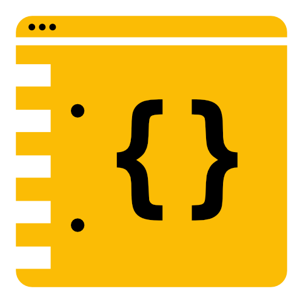

<figure><figcaption>Developer’s Notebook</figcaption></figure>

Today, I am happy to announce that Developer’s Notebook is being relaunched with lots of exciting stuff on the way!

When I founded Developer’s Notebook back in 2020, it was with the intention of running a blog with content specifically of interest to developers and tech enthusiasts. Unfortunately, life came in between and I wasn’t able to find the time to create any more for it.

Since then, however, my priorities have changed and I am happy to announce a relaunch of the website. While it will be with the same goal of creating great content for developers, there are going to be a couple of changes.

First of all, you may have noticed the new design. I have spent the past couple of weeks creating a new WordPress theme for the website which I will still be tweaking here and there, but it is far enough along that I can proudly show it off.

The next change is that I am not going to continue with the podcast. It was an interesting experiment at the time as it was my very first attempt to create one, but I have decided to focus more on text and programming examples instead which are difficult to translate into a podcast. The two podcast episodes are still available on the old [Podcast](https://www.developers-notebook.com/podcast/) page.

The last change is that I have closed the Twitter account. I did this a while ago, but I have no plans to recreate it with Elon Musk at the helm and the blocked API I was using to automatically post to it from the blog. The other accounts still exist though and you can find links to them in the footer below.

Otherwise, the content will heavily focus on what it has up to this point: nerdy, programmy, geeky, good stuff. I have a lot of new content already in the pipeline and am looking forward to hearing what you guys think about it!