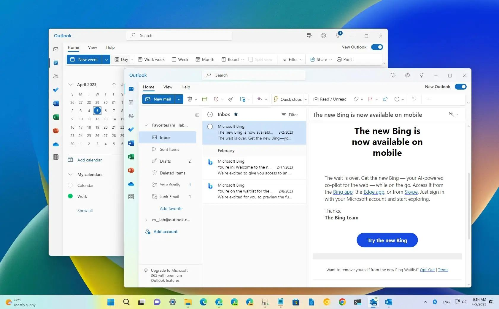
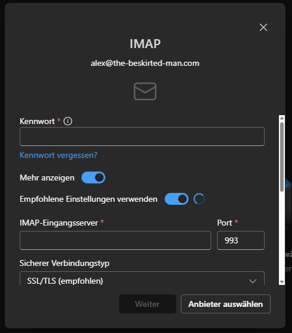

<figure><figcaption>Microsoft Outlook on Windows 11</figcaption></figure>

Microsoft’s new version of Outlook for Windows has seen [its fair share of criticism](https://duckduckgo.com/?q=complains+about+new+outlook+for+windows&t=h_&ia=web) and, frankly, rightfully so. It is a noticeable downgrade in many ways from the classic native application that has been with us since Outlook’s first release in 1997. The UI is more modern and it contains a bunch of new features such as better integration with iCloud and Google’s services, but as a web app rather than a native application, it is significantly slower and some really basic features are lacking.

The specific omission I wanted to mention is, frankly, shocking in 2024: the ability to add a username to an IMAP server. This is a basic, essential feature that has been around for decades and yet, the new Outlook doesn’t have it which just flabbergasts me. It may seem trivial, but it means that I can’t use it for my email because my web host requires a username that isn’t the email address. Outlook just assumes your email address is your username. Mail clients should never just assume anything because everyone’s setup and requirements are different.

<figure><figcaption>Outlook for Windows doesn’t allow you to set a username for IMAP accounts</figcaption></figure>

Instead, I’ve adopted Thunderbird as my email client of choice for Windows. It is a native application and, more critically, includes the extremely basic feature of being able to add a username to an IMAP server. It isn’t the prettiest of applications, even with the fairly recent design refresh, but it is functional, reliable and usable.

I have sent feedback to Microsoft using Outlook’s built-in feedback tool, but unsurprisingly, nothing has happened. There are also already two threads about it on Microsoft’s forums from 2023 ([thread 1](https://answers.microsoft.com/en-us/outlook_com/forum/all/new-outlook-app-how-to-add-an-imap-account-with/ef47acb7-b37a-4813-88c5-96899262813b) and [thread 2](https://answers.microsoft.com/en-us/outlook_com/forum/all/imap-username-in-new-outlook/67833994-9af9-4f1f-b0ad-2d5a8c3adfac)), but again, nothing has changed. I’m not getting my hopes up anytime soon and honestly, I’m not even sure I want to use it as my main mail client on Windows. I just like playing around and it’s always disappointing when my fun is spoiled by such an embarrassing omission.