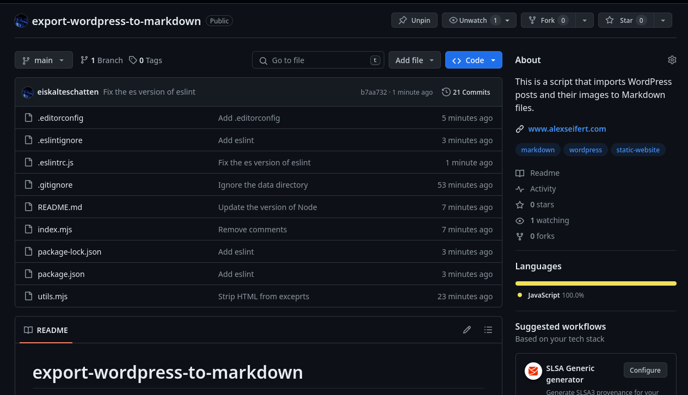
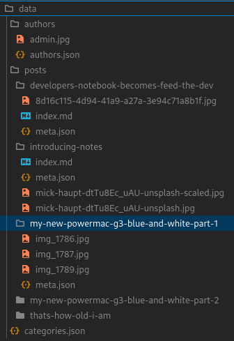

<figure><figcaption>A screenshot of the GitHub repo for the export WordPress to Markdown script</figcaption></figure>

I have a love-hate relationship with WordPress. On the one hand, it’s a great, stable piece of software that provides a great feature set for blogs. On the other hand, it has evolved into more than just blog software and more into a full CMS. That means it contains a lot more features than I need or want to run a blog.

I have been thinking about replacing WordPress and running this blog directly from my Next.js-based website at [www.alexseifert.com](https://www.alexseifert.com). I could just use the WordPress API from Next.js to import the posts and other data when building the Next.js application, but I would want to be able to shut down WordPress entirely, so that wouldn’t work.

That means I need another data source for my blog posts and the best, most reliable way to do that would be to export all of the posts to Markdown files. Of course, that also means downloading all images, categories, tags, authors, etc which is a lot of work.

So I did what most developers would do and wrote a script. I posted it to [GitHub](https://github.com/eiskalteschatten/export-wordpress-to-markdown) with instructions on how to use it. It is extremely easy to use and should work with any WordPress instance. The export results in a directory structure that looks like this:

<figure></figure>

Each post gets its own directory where all of its data will be stored. Categories are saved in a JSON file and authors are as well. Author avatars are also downloaded and saved. Tags are saved in each post’s meta.json file.

I might customize it or change it around again as needed, but this works for me now and should help move away from WordPress while keeping all of the relevant data.

You can find the repository on GitHub here: [https://github.com/eiskalteschatten/export-wordpress-to-markdown](https://github.com/eiskalteschatten/export-wordpress-to-markdown)