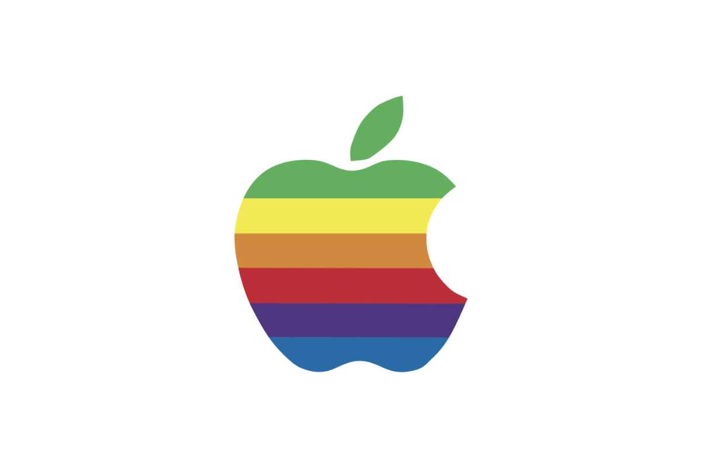

<figure><figcaption>Retro Apple Logo</figcaption></figure>

I have written about emulating both [Mac OS 8](https://blog.alexseifert.com/2024/03/17/mac-os-8-as-an-electron-app/) and [Mac OS 9](https://blog.alexseifert.com/2020/06/09/emulating-mac-os-9-on-macos-10-15/) on modern computers before, but recently I was given a tip about a website that allows you to not only emulate both of those operating systems in a browser but several older versions as well.

The website is called [Infinite Mac](https://infinitemac.org/). You can just open the page in your browser and fire up an older version of Mac OS (or “System” as it used to be called). Everything from System 1.0 to Mac OS 9.2.2 is there. They don’t have every single release, but most major releases are represented.

It’s a fun way to explore the classic Mac OS without even having to download or install anything. Of course, it’s less useful to those looking to run specific software, but it is a great way to try it out and play around.

[https://infinitemac.org](https://infinitemac.org)