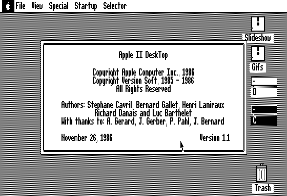

<figure><figcaption>Apple II DeskTop</figcaption></figure>

A little while ago, I stumbled upon [an interesting project](https://www.a2desktop.com/) whose goal it is to [emulate the Apple II DeskTop environment](https://www.scullinsteel.com/apple//e?accelerator_toggle=true&gl_canvas=false&mono_screen=false#https://a2desktop.s3.amazonaws.com/lkg.2mg) in the web browser. Emulation in browsers has been gaining traction in recent years as computers become powerful enough to run an entire operating system in a browser. Earlier this year, I wrote about [a website that allows you to boot up almost every version of the classic Mac OS](https://blog.alexseifert.com/2024/05/12/a-website-full-of-web-based-mac-emulators/) right from your browser.

I’m not incredibly familiar with the Apple II as I wasn’t around yet during its heyday, but I do know that for much of its life, its primary interface was a terminal. Eventually, Apple created a [GUI desktop environment for it](http://toastytech.com/guis/a2desk.html) and you can certainly tell that both it and the Macintosh desktop environment shared a lot of the same UI principles. Anyone who has used a classic Mac OS desktop will feel right at home here.

So here are the links:

-   The project’s homepage: [https://www.a2desktop.com/](https://www.a2desktop.com/)
-   The emulator: [https://www.scullinsteel.com/apple//e?accelerator\_toggle=true&gl\_canvas=false&mono\_screen=false#https://a2desktop.s3.amazonaws.com/lkg.2mg](https://www.scullinsteel.com/apple//e?accelerator_toggle=true&gl_canvas=false&mono_screen=false#https://a2desktop.s3.amazonaws.com/lkg.2mg)
-   More information about the Apple II DeskTop: [http://toastytech.com/guis/a2desk.html](http://toastytech.com/guis/a2desk.html)
-   And an open-source disassembly of it: [https://github.com/a2stuff/a2d](https://github.com/a2stuff/a2d)