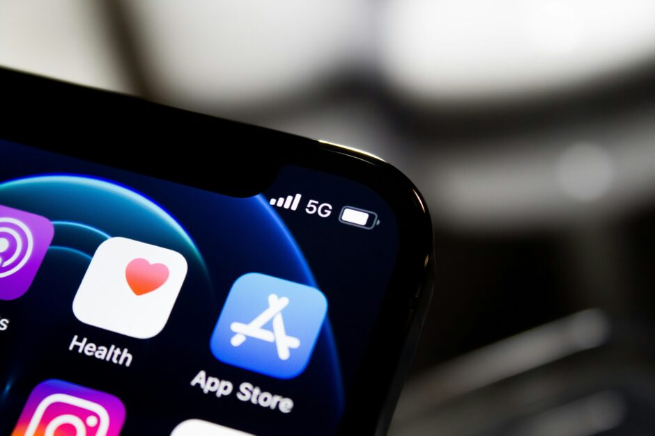

<figure><figcaption>Apple’s App Store Icon on iOS</figcaption></figure>

By now, it’s not news that the EU has passed a law that requires Apple to open up iOS to third-party app stores. Their response has been to comply to the letter of the law while entirely negating the intent of the law. As someone who has used Apple’s products since the late 1990s, I have to say I’m extremely disappointed by their behavior.

That said, I’m also not surprised. It is entirely within the character of the company to keep their system as locked down as possible and to make it nearly impossible to do anything without their direct approval.

And that is exactly what I am tired of. I have been experimenting with using a desktop PC now as my daily driver for the first time in decades and I have to say I am excited about the openness of it. I am currently experimenting with Windows 11 but will try out Linux soon. Also, the fact that I can buy generic components off the shelf for a decent price and upgrade my PC at any time is liberating.

Apple already having locked down its hardware to the point that makes any upgrades impossible was the start of the journey back into the world of PCs for me. Couple that with their outrageous prices for memory and SSD capacity as well as their [attitude toward starting their Macs with only 8 GB of RAM in 2024](https://www.theregister.com/2023/11/09/apple_exec_defends_8gb/), and I’ve had enough.

Their malicious compliance with the law in the EU is really the last straw for me and Apple. I don’t think I will be buying another Mac which is sad considering I’ve happily used every version of their OS since Mac OS 9 as a daily driver.

I will still continue to use an iPhone because unfortunately the only other alternative is Android and I dislike Google and its data privacy policies even more than Apple’s monopolistic attitude and ridiculously expensive hardware.

I hope the EU will reject Apple’s proposed plan to “open” iOS to other app stores and require them to comply with the intent of the law and not just the letter. If Apple refuses to do so, I hope the EU fines them heavily until they do so that it hurts right where it matters most: their bottom line.