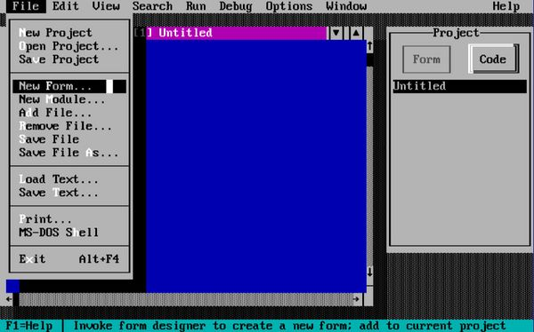

<figure><figcaption>Visual Basic DOS Main Screen</figcaption></figure>

In November last year, I wrote [a post about why the Windows 95 setup used three different operating systems](https://blog.alexseifert.com/2024/11/23/why-did-windows-95-setup-use-three-operating-systems/). That post was based on and quoted from [a post written by long-time Microsoft developer, Raymond Chen](https://devblogs.microsoft.com/oldnewthing/20241112-00/?p=110507), on one of Microsoft’s official blogs.

Well, at the beginning of February, Raymond published another post on the same Microsoft blog about comments he had received about his original post wondering whether the developers responsible for creating the Windows 95 setup had forgotten about the fact that MS-DOS could do basic GUI interfaces. The idea, of course, was that since MS-DOS could do basic GUI interfaces, the Windows 3.1 and Windows 95 parts of the setup were redundant.

Unsurprisingly, Raymond makes quite a few good points in [his response](https://devblogs.microsoft.com/oldnewthing/20250211-00/?p=110862):

> One of the reactions to my discussion of [why Windows 95 setup used three operating systems](https://devblogs.microsoft.com/oldnewthing/20241112-00/?p=110507) (and oh there were many) was my explanation that an MS-DOS based setup program would be text-mode. But c’mon, MS-DOS could do graphics! Are you just a bunch of morons?
> 
> Yes, MS-DOS could do graphics, in the sense that it didn’t actively prevent you from doing graphics. You were still responsible for everything yourself, though. There were no graphics primitives aside from a BIOS call to plot a single pixel. Everything else was on you, and you didn’t want to use the BIOS call to plot pixels anyway because it was slow. If you wanted any modicum of performance, you had to access the frame buffer directly.
> 
> \[…\]
> 
> But the setup program needs more than just pixels. It also wants dialog boxes, so you’ll have to write a window manager to sit on top of your graphics library so you can show dialog boxes with a standard GUI dialog interface, which includes keyboard support for tabbing between elements and assigning hotkeys to fields.
> 
> You’ll also have to add support for typing characters in non-alphabetic languages like Japanese. Fortunately, you have a team of folks expert in Japanese input sitting in the Tokyo office working on Windows input methods who can help you out, though the time zone difference between Tokyo and Redmond is going to slow you down.
> 
> \[…\]
> 
> Now take a step back and look at what you’re doing. [You’re writing an operating system](https://rachit.pl/post/you-have-built-a-compiler/). (Or, if you are being uncharitable, you’re writing an MS-DOS shell.)
> 
> An operating system with exactly one application: Windows 95 Setup.
> 
> What if I told you that Microsoft already had an operating system that did all the things you are trying to do, and it’s fully debugged, with video drivers, a graphics library, a dialog manager, a scheduler, a protected mode manager, and input methods. And it has a fully staffed support team. And that operating system has withstood years of real-world usage? And Microsoft fully owns the rights to it, so you don’t have to worry about royalties or licensing fees? And it’s a well-known system that even has books written about how to program it, so it’ll be easier to hire new people to join your team, since you don’t have to spend a month teaching them how to code for your new custom Setup UI miniature operating system.
> 
> \[…\]
> 
> [Raymond Chen](https://devblogs.microsoft.com/oldnewthing/20250211-00/?p=110862)

Of course, I’m not going to quote the entire thing here. I can definitely recommend you read through its tongue-in-cheek humor though. It definitely makes a compelling argument for why the Windows 95 setup team did not create a GUI for setup using only MS-DOS.

Here is the original article: [https://devblogs.microsoft.com/oldnewthing/20250211-00/?p=110862](https://devblogs.microsoft.com/oldnewthing/20250211-00/?p=110862)