<figure><a href="https://blog.alexseifert.com/2024/10/01/why-i-just-bought-a-bbedit-license-upgrade/bbedit-7-1-mac-os-9/">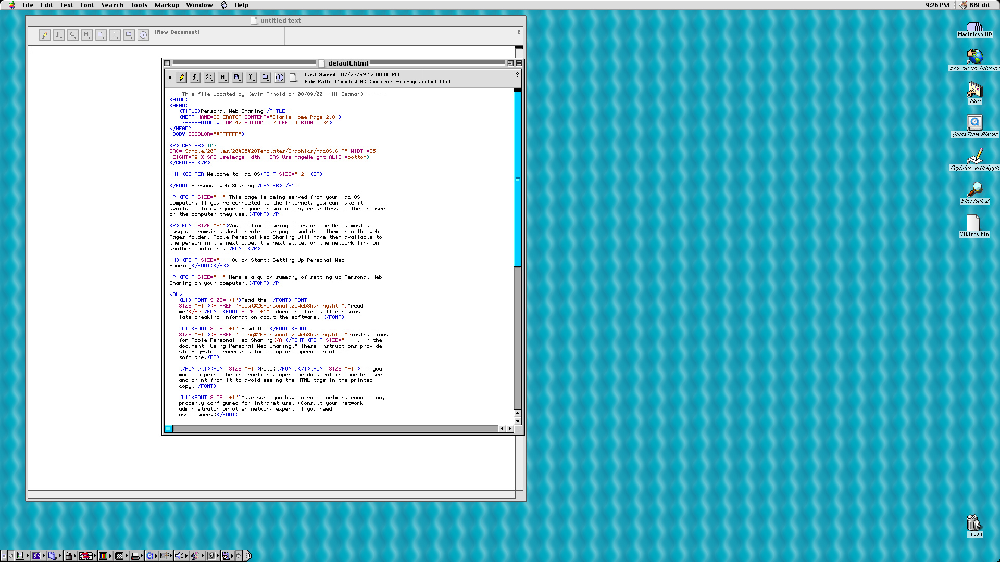</a><figcaption>BBEdit 7.1 on Mac OS 9</figcaption></figure>

I recently wrote about my decision to [upgrade my license for BBEdit](https://blog.alexseifert.com/2024/10/01/why-i-just-bought-a-bbedit-license-upgrade/) which, despite not using it as my primary editor, is still one of my favorite editors. That gave me the idea to write a post showcasing a list of editors and IDEs I have used throughout the years with a focus on web development. What is featured below are the ones that I remember using although I have played around with several others. In that sense, they have stood out for me in one way or another. I have tried to keep them in chronological order so that the earliest come first.

So, let’s get started. Just note that unless otherwise stated, the screenshots below aren’t mine. I have also tried to use era-appropriate screenshots for the times when I used them on the operating systems I primarily used them on.

FrontPage 2000
--------------

<figure><a href="https://blog.alexseifert.com/?attachment_id=4283">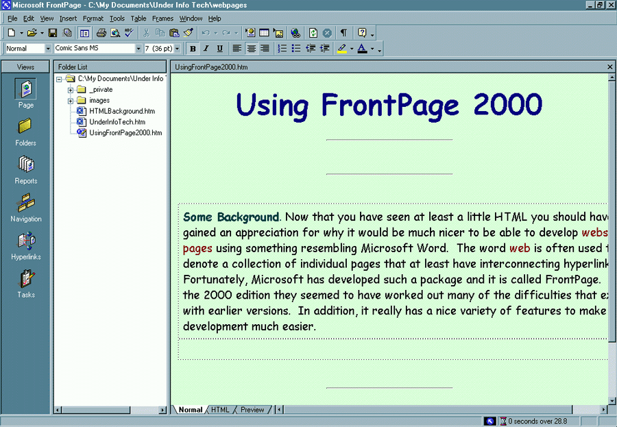</a><figcaption>FrontPage 2000</figcaption></figure>

You could argue that Frontpage shouldn’t appear on this list as it primarily served as a Word-like, WYSIWYG editor, but I decided to include it because it’s where I got started with web development. Appropriately, I used it on Windows 2000.

Eventually, I was driven to learn HTML (and CSS when it was first introduced) by the limitations of what you could do with design in Frontpage. These limitations weren’t inherently bad as they would probably have been helpful for someone wanting to create a website but not really interested in going into detail. However, I wasn’t satisfied with them and wanted to let my imagination run wild.

One last thing I recall about Frontpage: the code it generated was terrible. Once I had learned HTML, I would go back and look at the HTML created by Frontpage and nearly gag. There was way more code than necessary which made the pages bloated and load much more slowly in an era where every kilobyte mattered when it came to internet speed.

Adobe GoLive
------------

<figure><a href="https://blog.alexseifert.com/?attachment_id=4315">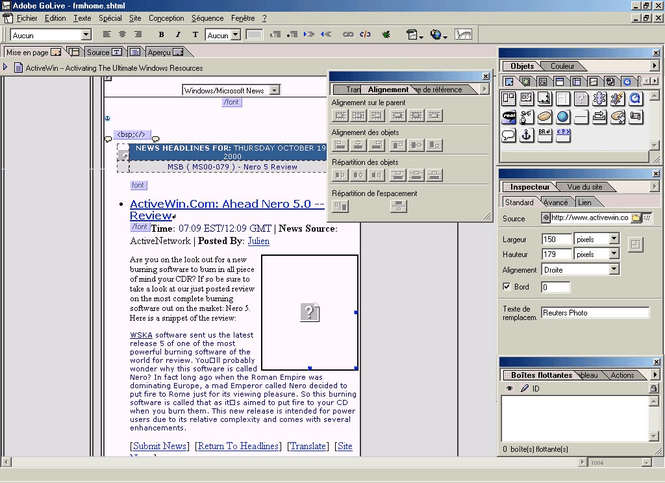</a><figcaption>Adobe GoLive 6.0</figcaption></figure>

Adobe GoLive was similar to Frontpage in that it was primarily a WYSIWYG editor, but it was much more flexible in that it didn’t restrict what you could design nearly as much. I added it to this list because I used it as a sort of stop-gap editor while I learned HTML.

Screenshots are insanely hard to find for some reason both for Windows and Mac OS. At around this time, I had gotten my first Mac and was using Mac OS 9 as well as Windows 2000. That was another benefit of GoLive: it worked on both platforms the same way.

1st Page 2000
-------------

<figure><a href="https://blog.alexseifert.com/?attachment_id=4286">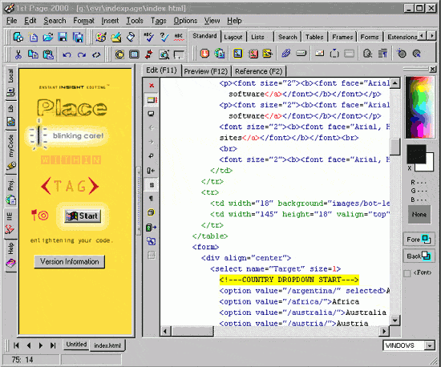</a><figcaption>1st Page 2000</figcaption></figure>

While learning HTML, I chose 1st Page 2000 to be my first actual editor. It was very helpful in that it had shortcuts for most HTML elements hidden away in that superfluity of tabs in the toolbar (see the screenshot above). While it might look like a terrible user interface choice, it was actually quite useful in that I could just click on a button if I had forgotten what the tag was for the element I wanted. That was a great help. The color palette on the side also helped me learn about HEX and RGB colors.

Unfortunately, it was Windows-only which meant I had to find an alternative for the Mac.

BBEdit
------

<figure><a href="https://blog.alexseifert.com/2024/10/01/why-i-just-bought-a-bbedit-license-upgrade/bbedit-7-1-mac-os-x-10-2/">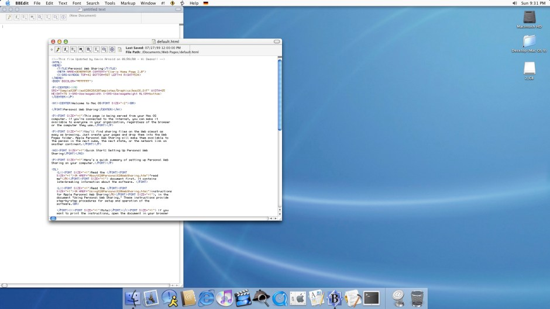</a><figcaption>BBEdit 7.1 on Mac OS X 10.2 taken on my Blue and White PowerMac G3</figcaption></figure>

And that alternative was BBEdit, the tried and true staple of Mac development and text editing. There is a reason why it still exists and is still a popular tool: it’s simple and does its job flawlessly. As I mentioned above, I just recently [upgraded my license](https://blog.alexseifert.com/2024/10/01/why-i-just-bought-a-bbedit-license-upgrade/) to version 15. I also wrote [a review about version 10.5](https://blog.alexseifert.com/2012/12/06/bbedit-positives-and-negatives/) years ago when it was new on this blog.

A good friend of mine has used BBEdit for even longer than I have and still uses it. It has accompanied him through the four different platforms Macs have been based on: 68k, PowerPC, Intel and now Apple Silicon. Since I started using Macs in their PowerPC phase, I can only boast about using BBEdit through three platform changes.

At the top of the post is a screenshot of the first version of BBEdit I used (7.1) on Mac OS 9. The screenshot immediately above is of the same version of BBEdit running on Mac OS X 10.2. I used BBEdit on both OSes and still continue to use it to this day for a lot of my editing needs.

Taco HTML Edit
--------------

<figure><a href="https://blog.alexseifert.com/?attachment_id=4290">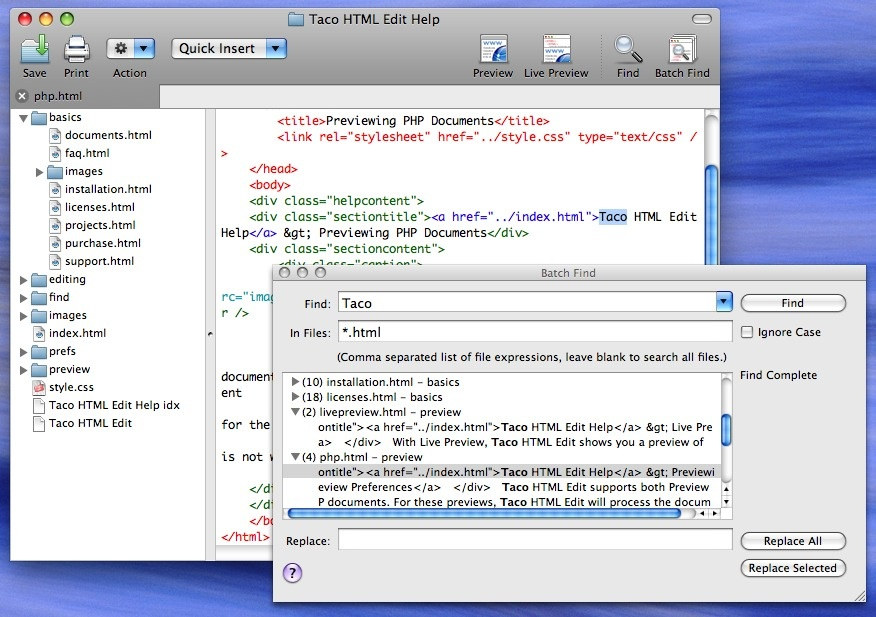</a><figcaption>Taco HTML Edit</figcaption></figure>

Believe it or not, there was actually an editor for the Mac called Taco HTML Edit. The icon was, unsurprisingly, a taco which meant I had a taco in my Dock for quite some time. The name worked though as I can still remember it to this day.

In any case, there isn’t a whole lot to say about it. It was a simple editor with a focus on web development. What initially attracted me to it was its use of tab, the live preview function and the novelty of its name and icon.

I used it for a while, but eventually went back to BBEdit. I’m always open to experimenting with new editors and still do to this day, but sometimes going back to what you started off with isn’t a bad thing.

Also, here’s a screenshot from the PowerBook G4 I had around 2005 running Mac OS X 10.3 Panther. If you look closely, you’ll see the taco in the dock:

<figure><a href="https://blog.alexseifert.com/2024/09/15/my-collection-of-mac-os-screenshots/mac_os_x_10_not_tiger_by_eatatranmas/">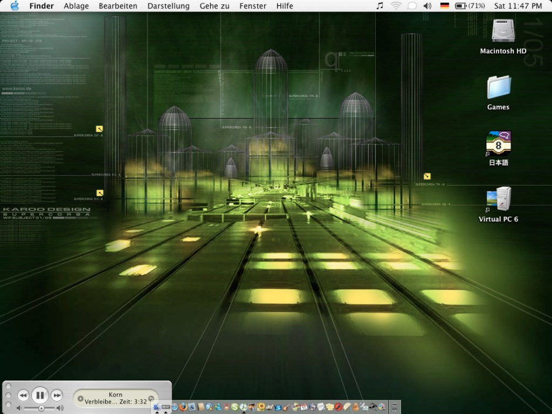</a><figcaption>Mac OS X Panther Running on a PowerBook G4 with a Taco in the Dock</figcaption></figure>

Panic Coda
----------

<figure><a href="https://blog.alexseifert.com/?attachment_id=4292">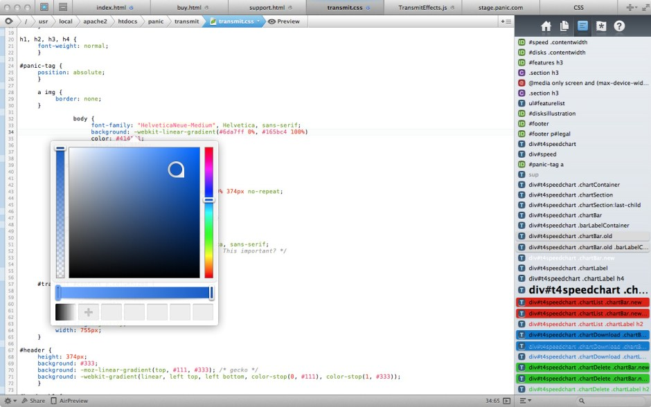</a><figcaption>Panic Coda</figcaption></figure>

As you have probably noticed by now, I have stopped featuring Windows editors. That is because I was a full-time Mac user by this point in my life. As a Mac user, I enjoy beautiful interfaces and Panic Coda was a real winner in that regard.

It was a Mac-native application (like BBEdit and Taco HTML Edit) that had a great design and feature set. Everything I needed for both personal projects as well as for work as a professional web developer was included. Coda no longer exists, but its successor, [Nova](https://panic.com/coda/), is most certainly on my radar of editors to try soon.

Eclipse
-------

<figure><a href="https://blog.alexseifert.com/?attachment_id=4294">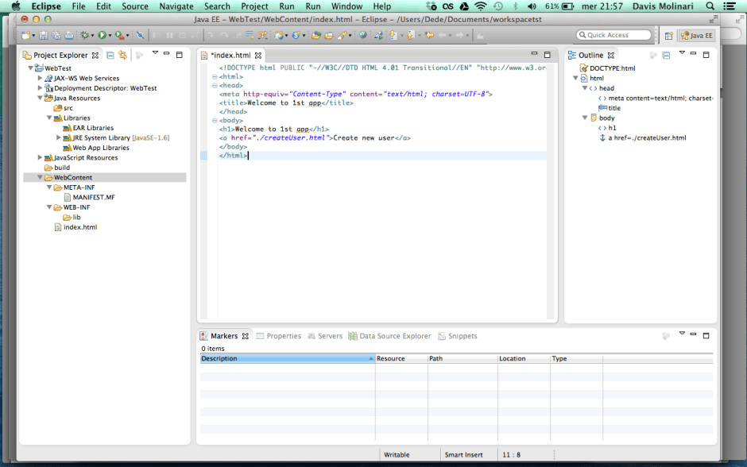</a><figcaption>Eclipse on Mac OS X in the era that I used it</figcaption></figure>

Pain. Lots and lots of pain. That’s the best way to describe my experience with Eclipse. Unlike the previous editors, this was one I didn’t use by choice. The company I worked for at the time had a webshop based on Java and Eclipse was what the team used. It may have worked well for the Java developers, but I was a frontend developer which meant only pain.

Other options were NetBeans or IntelliJ, but NetBeans wasn’t much better and we would have had to buy a personal license for IntelliJ if we wanted to use it because the company wouldn’t provide us with one.

NetBeans
--------

<figure><a href="https://blog.alexseifert.com/?attachment_id=4296">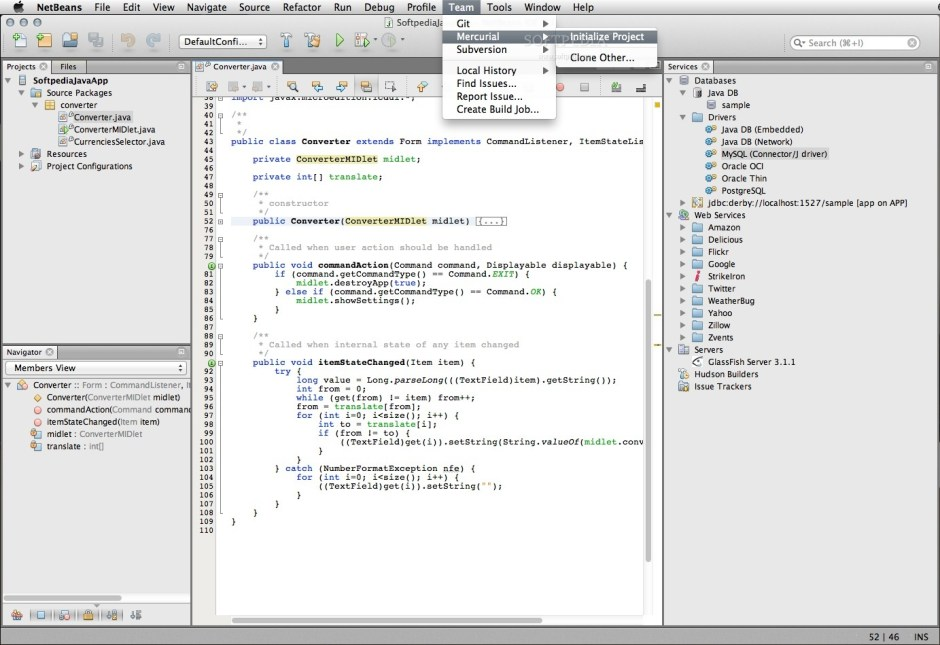</a><figcaption>NetBeans</figcaption></figure>

Just, no. I tried out NetBeans for a while as an alternative to Eclipse and it wasn’t any better. I did give it a real shot though because I disliked Eclipse so much. Since I didn’t like NetBeans any better, I eventually went back to Eclipse since that was what the Java developers were using and I could get support from them if (when) something went wrong.

The choice between Eclipse or NetBeans was a little like having to choose between a third-degree burn or a compound fracture.

IntelliJ, PhpStorm, WebStorm by JetBrains
-----------------------------------------

<figure><a href="https://blog.alexseifert.com/?attachment_id=4298">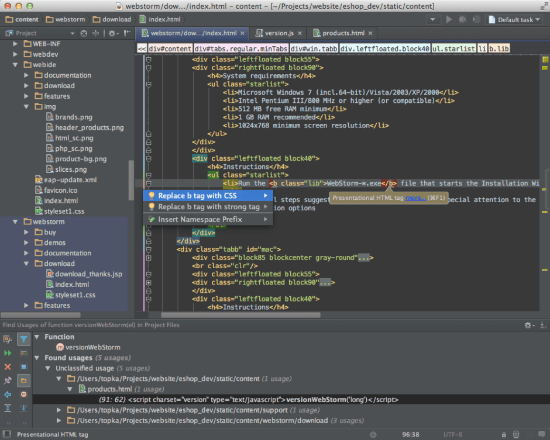</a><figcaption>WebStorm</figcaption></figure>

At some point, the company decided to be generous and buy a few IntelliJ licenses which was an enormous relief. I actually enjoyed using IntelliJ enough that I decided to purchase a PhpStorm license for use with my personal projects. At the time, I mostly used PHP for my personal projects.

The next company I worked for had multiple applications and I was initially assigned to one that used Node.js. As such, I was provided with a WebStorm license, so I used that for quite a while as well. I even wrote a post about [using WebStorm to debug Node.js running in a Docker container](https://blog.alexseifert.com/2016/10/25/debugging-node-js-in-a-docker-container-with-webstorm/) on this blog. As with IntelliJ and PhpStorm, I rather enjoyed using it.

Sublime Text
------------

<figure><a href="https://blog.alexseifert.com/?attachment_id=4303">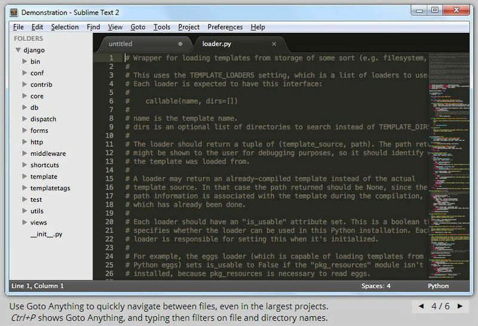</a><figcaption>Sublime Text 2</figcaption></figure>

However, later at that same company, I was moved to another project that used Perl as its primary language. As such, I needed a new editor. BBEdit was off the table because, as you can see in the screenshot above, I was given a PC with Windows 7. So, I chose what some of the others in the team were using: Sublime Text.

It was actually a pleasure to use. While I enjoyed the JetBrains IDEs, it was somewhat of a relief to be back in a such a lightweight, native editor. Sublime Text is cross-platform, but is entirely written in C++ and compiled to a native binary rather than run as a Java application. The difference in speed and resource usage is absolutely noticeable.

Also, it might technically require a license, but you can use it indefinitely for free. When it comes to this editor, I’m an outlier though since, believe it or not, I bought a license. Mainly for the same reason I upgrade my BBEdit license: to support the project.

Visual Studio Code
------------------

<figure><a href="https://blog.alexseifert.com/?attachment_id=4306">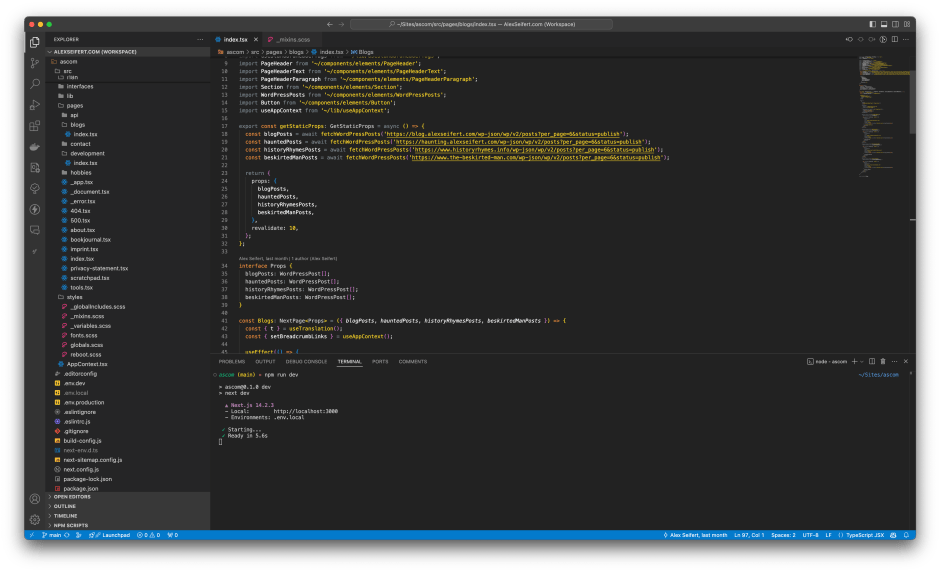</a><figcaption>Visual Studio Code taken on my 2019 MacBook Pro while writing this post</figcaption></figure>

Just before I left that company, a coworker turned me onto a then-new project by Microsoft called Visual Studio Code which, other than BBEdit, has become my longest-serving editor to date. I still use it as my primary editor as it has a robust feature set that makes my work much easier and more convenient which is not something Sublime Text has. One example is support for git. At the time, Sublime Text had no support for git whatsoever and even now, you have to buy a separate product from them in order to really get full support for it. Visual Studio Code includes it out of the box.

JetBrains’ IDEs also include it, but Visual Studio Code is free. I also don’t have to install separate IDEs for different languages which, since I frequently dabble in different languages, is important to me.

That said, I’ve had somewhat of love-hate relationship with the editor. I love the feature set which is what keeps me using it, but unlike Sublime Text or BBEdit, it is not a native application. It is a web application within the [Electron framework](https://www.electronjs.org) which means performance is sometimes lacking, not to mention it is a resource hog. The IDEs from JetBrains aren’t any better in either of those regards. Sometimes, I wonder why I need several gigabytes of RAM just to run an editor.

However, the benefit is that it is cross platform. A couple of years ago, I purchased a PC for the first time in decades and installed both [Windows 11](https://blog.alexseifert.com/2024/03/08/how-windows-11-has-convinced-a-skeptic/) and [Linux (Fedora)](https://blog.alexseifert.com/2024/08/08/using-linux-on-my-pc/) on it. With Visual Studio Code, I can have the exact same coding environment on all platforms. It even synchronizes my plugins and settings via a Microsoft or GitHub account.

Vim
---

<figure><a href="https://blog.alexseifert.com/?attachment_id=4309">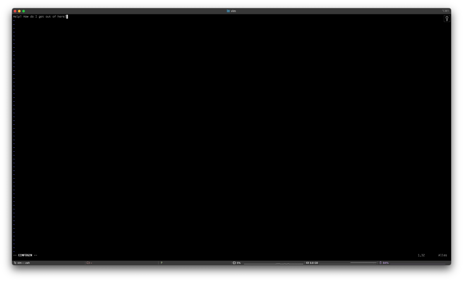</a><figcaption>Vim taken on my 2019 MacBook Pro while writing this post</figcaption></figure>

Now that I’ve complained about Visual Studio Code being a resource-hog, it’s time to talk about an editor that is exactly the opposite: Vim. Despite having BBEdit and Visual Studio Code in my Dock, I also use Vim every day. I don’t use it for much more than quick edits, but I find it extremely convenient to use when I just want to make a quick change to a file when I’m already in the terminal rather than launching one of the GUI editors. I know there are commands for both Visual Studio Code and BBEdit to open a file in them from the terminal, but Vim is just faster for quick changes.

I also use it on servers. As a web developer, I often find myself accessing various Linux servers via SSH and using Vim to edit files just makes sense in that context. The same could be said about nano or emacs, but Vim is my personal preference.

When working at the company with the Perl project, I did go through a brief phase where I tried out using Vim as a full IDE. That was inspired by a teammate who did exactly that and was happy with it. It didn’t last long though because I kept having issues with a critical plugin I needed to make daily use viable. Eventually, I gave up and switched to Sublime Text. Plus, I am a very visual person and prefer an interface that isn’t text-based.

Conclusion
----------

The focus of this post was on editors and IDEs for web development. What I didn’t include was IDEs such as Visual Studio, Xcode or its predecessor, Project Builder, all of which I have also used for native application development. Maybe that will be another post sometime in the future.

As far as editors and IDEs go, it’s been a wild ride. I’ve settled on a combination of Visual Studio Code, BBEdit and Vim for now, but that doesn’t mean it won’t change in the future. In fact, I would welcome change because what I would really like is a robust, native editor or IDE for Mac that has a similar feature set to Visual Studio Code. It would need to provide first-class support for multiple languages and frameworks as well as contain features such as debugging and version control. Unfortunately, such a beast doesn’t exist yet.

*If you know of any good editors or IDEs I haven’t tried yet or want to show off what you’ve used, please let me know in the comments!*