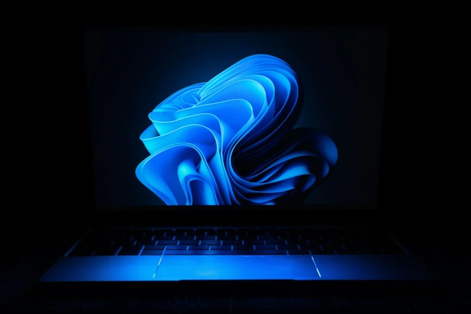

<figure></figure>

Until about two years ago, I was exclusively a Mac user. I started using Apple computers when Mac OS 9 was the latest version and they were still plastic and colorful. Since then, I have used every version of Mac OS X (and subsequently macOS) as my daily driver.

Macs got me through college and I have had the privilege of using them at every job I have had, other than a brief stint with Windows 7 at one of the companies I worked for. That experience was miserable, so I never thought I would ever use Windows as a daily driver as long as I could feasibly avoid it.

But then things changed. I broke down and bought a refurbished desktop PC with Windows 10 out of sheer curiosity.

I thought it would be a fun project box to play around with Windows, but also with Linux distros which is why I wanted a desktop. I wanted to be able to install multiple SSDs to play around with the various operating systems.

The PC I had had at work with Windows 7 was locked down to the point that I couldn’t do my job and had to rely on a Linux virtual machine in VirtualBox to be able to actually do the job I was hired for. I knew Windows wasn’t normally that restrictive, so I wanted to give it a serious try at home for the first time since Windows 2000.

What I found surprised me. Windows 10 wasn’t as bad as I remembered Windows being. It quickly became clear to me that Microsoft had really polished Windows and fixed a lot of the issues that made me switch to Mac in the first place.

Soon afterward, Windows 11 was announced. My old, refurbished PC wouldn’t run it because it didn’t have a TPM 2.0 chip which was a controversial requirement for Windows 11. Between that and Google shutting down Stadia which is where I used to play my all-time favorite game: Red Dead Redemption II, I decided to invest in a new desktop PC.

I enjoy fiddling around with hardware, so I took my time and researched parts to build my own PC. A lot had changed since the last time had built a desktop PC which meant I had a lot to catch up on. A few days later and I had my parts list ready to order.

This is where PCs really shine. I didn’t have to order the parts all at once and was able to spread the cost of the new PC out over the course of several months. This made financial sense and made my wife more accepting of my choice to buy a new PC.

Once I got everything and put the PC together, I bought a new license for Windows 11 Pro. I installed it and was very pleasantly surprised. It was a lot more polished than Windows 10. Since I am picky about interfaces, Microsoft products have never particularly appealed to me, but I’ve found that I enjoy Windows 11’s interface and design.

The only drawback is that it’s Windows and web development on Windows is a marginally good experience at best. There is, of course, the Windows Subsystem for Linux which I think Microsoft has done a great job with, but in the end, you’re still working in a virtual machine and it’s noticeable when you work with it every day.

So I’ve compromised. I still have a 2019 MacBook Pro that I use for more of my development and most of everything else I do on my new desktop. That obviously includes gaming even though I’m not a huge gamer and can go for weeks without actually playing one.

I’m planning on installing Linux on a separate SSD to give that a shot on my new PC, but I haven’t gotten around to it. I tried out Ubuntu for quite a while on the old, refurbished PC, but I haven’t installed it on the new one yet. I did enjoy the experience, however.

*What do you think about Windows 11? Do you think it’s an improvement over Windows 10 or other previous versions of Windows? Let me know in the comments below!*