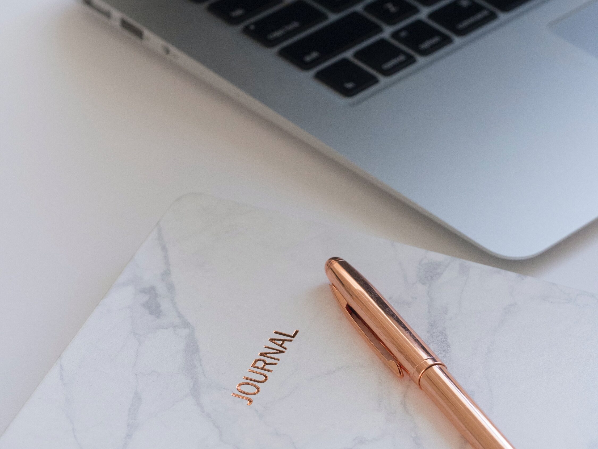

<figure></figure>

As I have [written about before](https://blog.alexseifert.com/2023/02/12/my-daily-journaling-habit/), I have been an avid journaler for over ten years and I have tried a number of different ways to write throughout that time. I started out on paper and stuck with that for quite some time, then I moved to a digital journal which I tried for a few years. So what do I prefer and why?

Unfortunately, the answer isn’t all that black and white. It might be for some people, but it’s much more nuanced for me. Both have their advantages and disadvantages and it really comes down to personal preference.

A Brief History of My Journaling
--------------------------------

When I first started journaling in 2013, I wrote in a five-year journal with limited space for each day. That was a wonderful format to get started with because it meant I couldn’t write too much and burn myself out on it too quickly. I wrote in there for the entire five years, filling up every slot.

After that, I moved to a normal, albeit fancy paper notebook. It had thick paper, was decorative and generally fun to write in. It was the first time I had the space to write longer entries, but by then I was so in the habit of journaling every day, that I wasn’t worried about burning myself out and quitting.

That notebook was followed by another fancy notebook and so on for a number of years. I enjoyed writing in the more expensive notebooks because the paper quality was better, thicker and would (hopefully) withstand the damage of time better than thinner paper.

In 2019, I decided to switch things up and go digital. Since I use a Mac as my primary computer, I naturally went straight to Apple Pages. I didn’t need anything fancy or any special journaling software because I just wanted to write long-format like I was used to from writing on paper.

After writing the first couple of entries, I realized I could add photos. So I did just that. I added a few photos from each day for quite a while. That is a huge advantage over writing on paper. The other advantage was that I could write more and for longer since I am much faster at typing than writing. Hand cramps were a thing of the past.

At the end of each year, I then printed my journal out on good-quality paper and put it in a binder because I wanted a hardcopy in case of file corruption or something happening to my computer and backups.

I did this until the end of last year when I decided to go back to paper again. So why did I change my mind?

Digital Journaling vs Paper Journaling
--------------------------------------

While I was typing my journal on my computer, I feel like I took advantage of all the features of digital journaling that I was interested in. I used photos, I had multiple backups, I was able to write more without hand cramps, and so on. I never used anything other than Apple Pages because it was simple, free and did exactly what I needed: photos and words with a little formatting.

What I didn’t realize during the time I was writing my journal on the computer though was that my entries were continuously creeping up in length. I would spend more and more time extensively writing about everything that had happened that day and what my thoughts were.

On the one hand, it’s going to be great detail for later, but burnout eventually reared its ugly head and I lost interest in journaling despite having been in the habit for so long. So, I took a break. I didn’t journal for about six weeks which is by far the longest time I have gone without since I started.

By the time I came back to it, I decided to limit the amount of time I gave myself to write. This worked pretty well for a while, but I found myself constantly going over the time and finding some sort of excuse to justify it. So, I needed another solution.

That solution came in the form of a new paper notebook late last year. By writing more slowly by hand, I reach a natural limit as to what I can write in a single session. This forces me to pay more careful attention to what I am writing and especially to how much. It also has the added benefit that I ramble less in my entries.

My Conclusion
-------------

For the foreseeable future, I am going to keep writing my journal on paper. While typing it was convenient and being able to add photos made my entries come more alive, I feel like I have a healthier relationship with journaling when doing it by hand.

No matter what medium you choose, keeping a journal is absolutely something that I can recommend. It helps you clear your head, closes off the day nicely and also leads to clearer thoughts. It’s become a very important part of my nightly routine and it’s one that I sorely missed when I took a break.