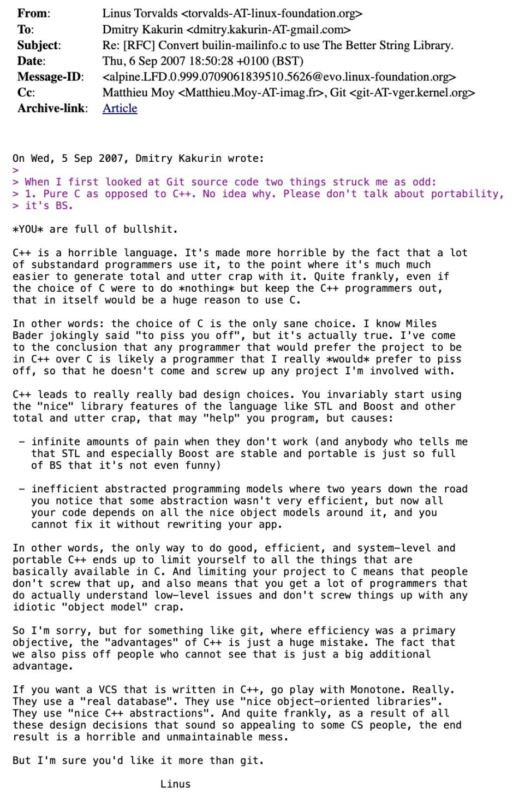

I somewhat recently ran into this screenshot of [a rant that Linus Torvalds went on about C++](https://lwn.net/Articles/249460/) and why he thinks C is the better programming language. I usually don’t care much for the drama because I think each programming language has its purpose and there will always be developers who love them and hate them. However, what I did find interesting about this particular rant is that it not only came from a very well-respected developer who has a deep understanding of low-level languages, but also that his arguments fly in the face of conventional, modern software architecture.

What I mean by that is that he argues against object-oriented programming, class inheritance and other core principles of most modern languages. I am, of course, aware that his rant is nearly twenty years old but even then, those were the important principles in software architecture.

You can read his rant here:

<figure><figcaption>Linus Torvalds on C++</figcaption></figure>