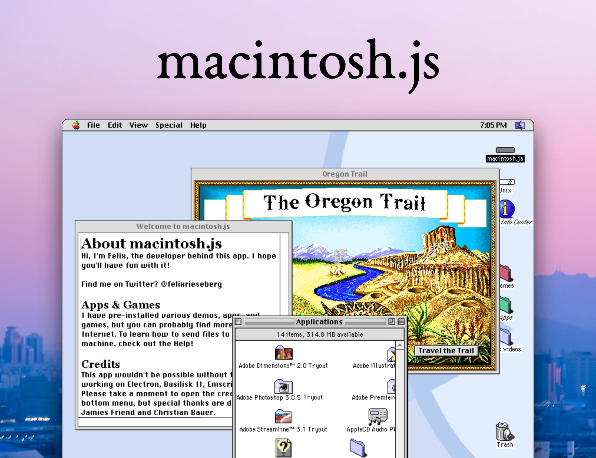

<figure><figcaption>Mac OS 8 running in Electron</figcaption></figure>

It really is amazing to consider how far technology has developed over the past few decades. What once required the use of an entire computer to run can now be run in a browser.

[Macintosh.js](https://github.com/felixrieseberg/macintosh.js) is a fun open-source project that runs Mac OS 8 in Electron. It emulates a 1991 Macintosh Quadra and runs the full operating system. The emulator also comes with a number of programs pre-installed which makes it a full nostalgic experience.

Since it runs in Electron, it is available for macOS, Windows and Linux. You can download it from the project’s [GitHub page](https://github.com/felixrieseberg/macintosh.js).

Even if you aren’t an Electron fan, you have to admit that it’s pretty impressive that essentially an entire computer can run in a browser environment. It may not have anything to do with Electron specifically, but it really does just go to show how far technology has developed since Mac OS 8 was released three decades ago.

The project’s GitHub page: [https://github.com/felixrieseberg/macintosh.js](https://github.com/felixrieseberg/macintosh.js)