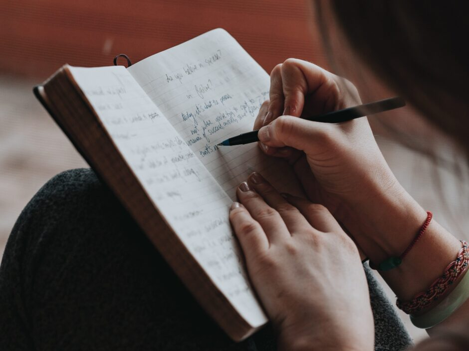

<figure></figure>

Ten years ago today, I wrote my very first journal entry. Little did I know at the time that it would become a daily habit that I still practice today. A quick search online will show that a lot of people aspire to keeping a daily journal, but aren’t able to stick with it even if they do manage to start.

I won’t sugar-coat it: it is a lot of work and can sometimes take quite a bit of will-power to sit down and write every day.

That said, it can also come easily. There is nothing quite like the experience of sitting down and getting your thoughts out in writing. It has a therapeutic effect that I haven’t experienced any other way. It doesn’t matter which medium you choose, as long as you get your thoughts out on (virtual) paper.

The topic of medium is a very sensitive one amongst journaling enthusiasts. Everyone has their own preferences for as many reasons as there are people who journal. I have tried a number of different mediums: the classic spiral notebook, Moleskine notebooks, Apple Pages, Microsoft Word, Google Docs and Leuchtturm1917 notebooks.

In the end, I’ve gone back to paper because I always write my entry right before going to bed. I’ve found it’s a wonderful relaxant to turn everything off except for the lamp on my desk and sit in the quietness that permeates the room when my computers are off while writing about my day.

It helps me fall asleep because I am able to get everything out about the day before going to bed. If there is something that is particularly bothering me about the day or was especially stressful, then I make sure and get it out there so that I don’t lie there in the dark with those thoughts circling around in an endless spiral that results in not much sleep.

How I Got Started
-----------------

I got started by making the barrier to entry as low as possible. I purchased a notebook from Leuchtturm1917 that limits you to only a couple of sentences a day. Every page is a day, but it is divided into five separate boxes for writing. The idea is that you write only a few sentences a day for five years.

The notebook is called [Leuchtturm1917 Some Lines a Day: 5 Year Memory Notebook](https://www.amazon.com/Leuchtturm-Lines-Memory-Medium-Black/dp/B00ACDNP70?crid=3CP8S0M8ZTUAD&keywords=leutherm1917%2Bsome%2Blines%2Ba%2Bday&qid=1673627516&sprefix=leutherm1917%2Bsome%2Blines%2Ba%2Bda%2Caps%2C172&sr=8-21&th=1&linkCode=ll1&tag=alexsnotebook-20&linkId=237292eeed645c1dd36ef2ba2710ec4c&language=en_US&ref_=as_li_ss_tl).

By restricting what I could write per day, it allowed me to develop the habit over time without overwhelming myself. The result is that I wrote for all five years and filled up the notebook entirely. After I ran out of room, I moved to a regular notebook which wasn’t a huge leap because I had already developed the habit of writing daily which made it easy to keep going.

Over time, my entries became longer and longer until they filled up entire pages themselves. After a while, however, I noticed there was a lot of repetition in them. I would write about almost everything that happened in my day, including my meals with phrases like, “I ate dinner with my wife this evening.”

Once I became aware of that, I trimmed my entries back down to about a third of a page because that sort of repetitive information wasn’t doing anything for me other than giving me a hand cramp. It would also be incredibly boring to read back on if I did decide to go back one day and read what I wrote.

How It’s Going Now
------------------

After four years of journaling electronically, I decided to go back to paper this year. I mentioned my reasoning for that above and I am incredibly glad that I did. I still mostly write short entires every evening that highlight the interesting, unusual or the particularly stressful events of the day. Anything else is just noise that isn’t necessary for me.

Of course, every person who journals has to determine what they want to write about. If you enjoy writing about the mundane, than no one is saying you can’t.

I enjoy writing and a big part of that is journaling for me. While it can be tedious, especially when there is a lot going on (think Christmas or a wedding!), I always find it’s worth it in the end. You are giving your present self a gift by creating a safe space to get out anything that might be bothering you or by just simply reflecting on your day. You are also giving your future self a gift by creating a record of your life you can look back on later.

If you haven’t tried keeping a journal before, I can only recommend it. If you are an avid journal-writer, then it would interest me what sort of motivation you have to keep sitting down to write. Feel free to let me know down in the comments below!