<figure>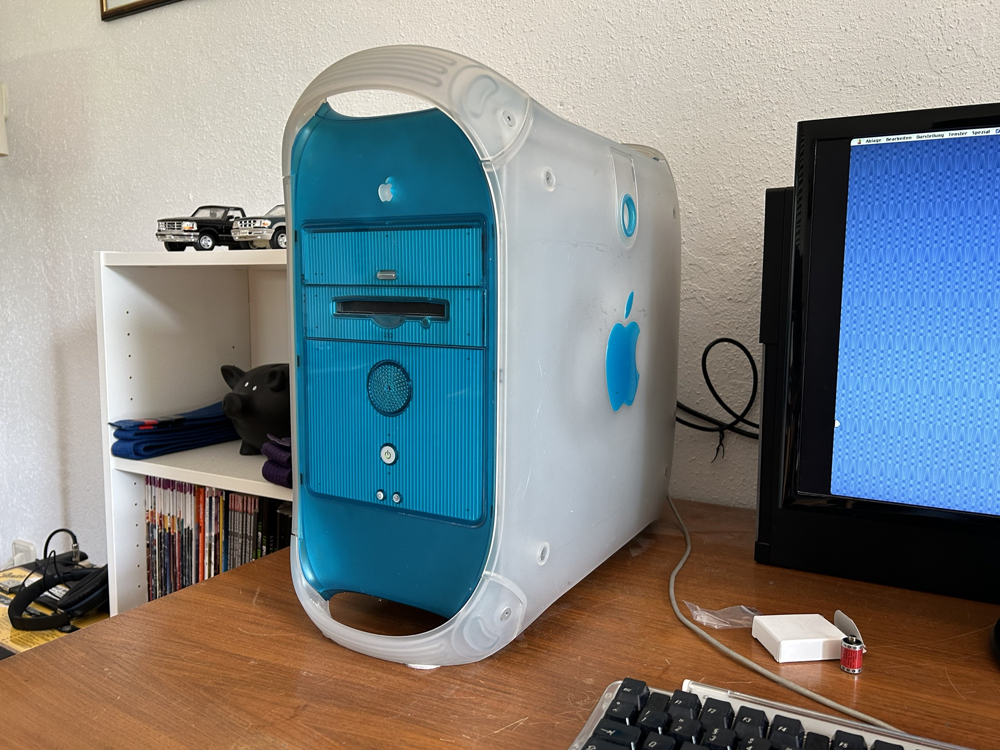<figcaption>PowerMac G3 Blue and White</figcaption></figure>

A couple of weeks ago, I was browsing eBay when I made an impulse purchase: a PowerMac G3 Blue and White. The computer was in excellent condition and fully functional which is why I didn’t have to think long before clicking the “Buy Now” button. It cost me €150 (about USD 160) which I thought was a rather good deal considering how rare it is to find one at all, much less one in good, fully working condition.

This was one of the Macs that got me to switch to a Mac in the first place. I grew up with a friend whose dad had one and we always played games on it. We had beige Windows PCs at home so this colorful PowerMac G3 Blue and White was refreshing and I have wanted one ever since.

And now I have one. Well, two actually. I bought one a while ago, but it has a severely corroded motherboard due to an exploded clock battery which means it’s now going to be a parts doner in case I need them for my new PowerMac.

Here are the specs of my PowerMac G3 Blue and White as it came:

-   PowerPC G3 350 MHz single-core processor
-   512 MB of RAM
-   41 GB HDD
-   Mac OS 9.2.2

It came with an old Apple Pro Keyboard and the original “hockey puck” mouse that was and is so miserable to use. It didn’t come with much software, but that is fine because I have a fairly sizable collection of old Mac software and there is always [Macintosh Garden](https://macintoshgarden.org/) in case I want something specific I don’t already have.

Now, let’s see some pictures:

-   <figure><figcaption>PowerMac G3 Blue and White</figcaption></figure>
    
-   <figure>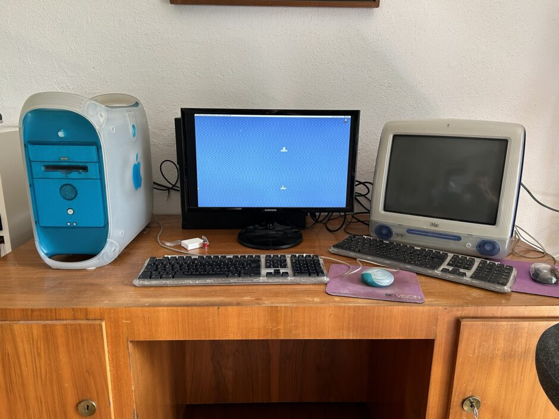<figcaption>My Full Desk Setup with Both of My Vintage Macs</figcaption></figure>
    
-   <figure>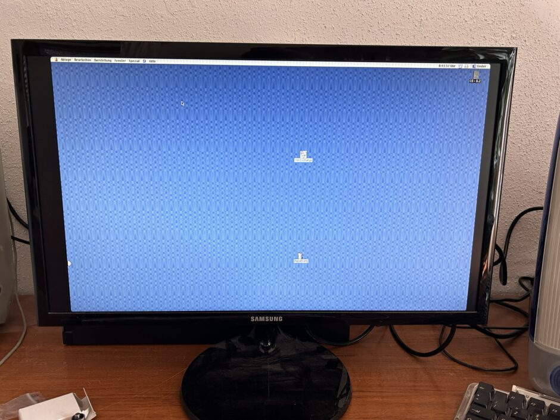<figcaption>Mac OS 9</figcaption></figure>
    
-   <figure>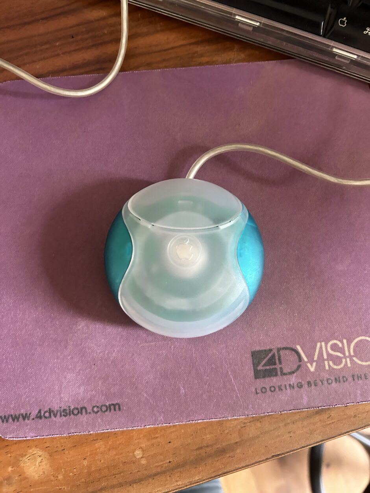<figcaption>The Infamous “Puck” Mouse the PowerMac G3 Came With</figcaption></figure>
    
-   <figure>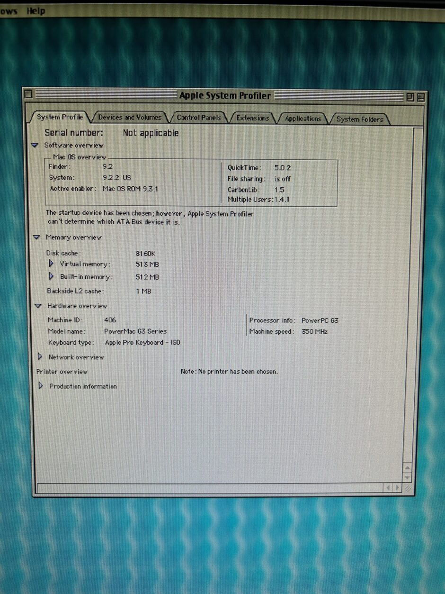<figcaption>The PowerMac G3 Specs</figcaption></figure>
    

Why? Just, why?
---------------

You might be wondering why I would spend money on a 25-year-old computer that by modern standards is so slow and out of date that it surely can’t do much. Well, other than the nostalgic reasons mentioned above, I happen to have a lot of software, including old games, from that era that I used back in the day and want to be able to run again.

Also, it’s just simply a fun project. It may not be for everyone, but I enjoy tinkering around with computers, and having an excuse to play around with a new (old) one is always a welcome pastime.

So what is there to tinker with? There is the aforementioned software, of course, but before I get to that, I’m going to start with the hardware. First, some routine maintenance needs to be performed to keep this old computer in good working order, and then we can upgrade some of the hardware to make this Mac perform at its best.

Routine Maintenance
-------------------

Like with any old computer, the first order of business is some routine maintenance to ensure it continues to work for years to come. Computers from this era suffer from both exploding clock batteries as well as the [Capacitor Plague](https://en.wikipedia.org/wiki/Capacitor_plague) which means those need to be addressed immediately.

The first thing I did was replace the clock battery. The one it came with was still the original and labeled as being from 1998. Luckily, it hadn’t exploded or leaked at all which means everything is still in perfect condition.

After that, I checked for bad capacitors. Fortunately, there aren’t any non-solid electrolytic capacitors on the PowerMac G3’s motherboard and a quick check of the power supply showed that they still look good. That means everything checks out and no recapping is necessary for now.

The last piece of maintenance I did was to clean it all out. I took the computer outside on a nice, dry day along with my canned air and blew as much of the dust, hair, and grime out as I could. I still need to take the blue and white case apart and give the plastic a good scrubbing and the keyboard needs some desperate attention (it is utterly filthy under the keys), but otherwise, the computer is clean enough to start with the fun part.

Upgrades
--------

Some retro computer enthusiasts don’t like to replace old hardware with new alternatives so that they can authentically experience their old computer as it was back in the day. I am not one of those. I will definitely keep the original hardware around that I replace and will not make any permanent changes, but some simple upgrades will enhance the experience.

For now, the only change I’m going to make is to replace the old HDD with an SSD. With some of the noises the HDD makes, it is clearly failing which means it will have to be replaced sooner rather than later. I could use another HDD, but if I’m going to exchange it, I may as well use something faster.

I may upgrade the RAM at some point in the future because it only has 512 MB and the max the PowerMac G3 Blue and White supports is 1 GB, but 512 MB is more than enough for anything I want to do with it at the moment, so I’ll skip that for now.

So why am I using an SSD instead of Compact Flash? The answer is entirely pragmatic: I’ve had an extra one lying around for months and don’t know what to do with it. I would have to purchase a Compact Flash card plus an IDE adapter for it which would have cost significantly more than just purchasing a SATA-IDE adapter for the SSD.

The PowerMac G3 Blue and White is one of the first Macintoshes to use IDE controllers instead of SCSI for drives which gives me a little bit of a speed boost over the beige PowerMac G3s. That said, its Ultra ATA/33 bus still by far can’t make use of the full speed of the SSD and can only see up to 128 GB. The SSD is 240 GB, but since I wasn’t using it anyway, I don’t care that half of the space will go unused. It also means I get to take advantage of the full capabilities of the IDE bus and max out the hard drive space.

### How the Upgrade Went

Well, it could have gone smoother if I had just turned my brain on before starting the upgrade. It’s certainly not the first time I have installed a new hard drive or SSD into a system, so the reason that it took a while for any of the Mac OS installers to actually see it was entirely asinine: I forgot to format it.

That cost me about an hour of extra time trying to diagnose what I thought was a hardware problem. I thought that maybe the adapter wasn’t working or the SSD was broken. I even installed it in an old project PC I have sitting around and sure enough, Windows could see it just fine. That, however, led me to realize I needed to format it first since I had to open Disk Management to see it. Oops.

In any case, it works now. Let’s see some more pictures:

-   <figure>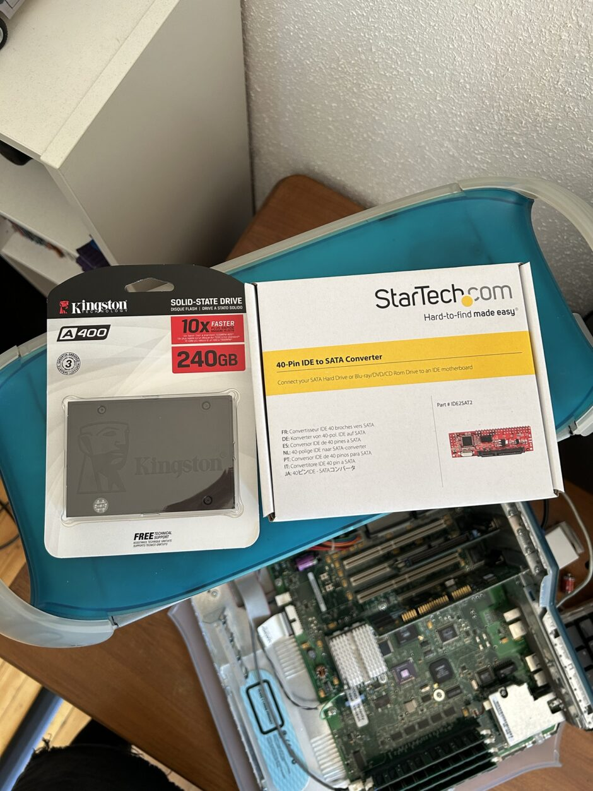<figcaption>The SSD and IDE-SATA Adapter for the PowerMac G3</figcaption></figure>
    
-   <figure><figcaption>The IDE-SATA Adapter</figcaption></figure>
    
-   <figure><figcaption>The IDE-SATA Adapter</figcaption></figure>
    
-   <figure>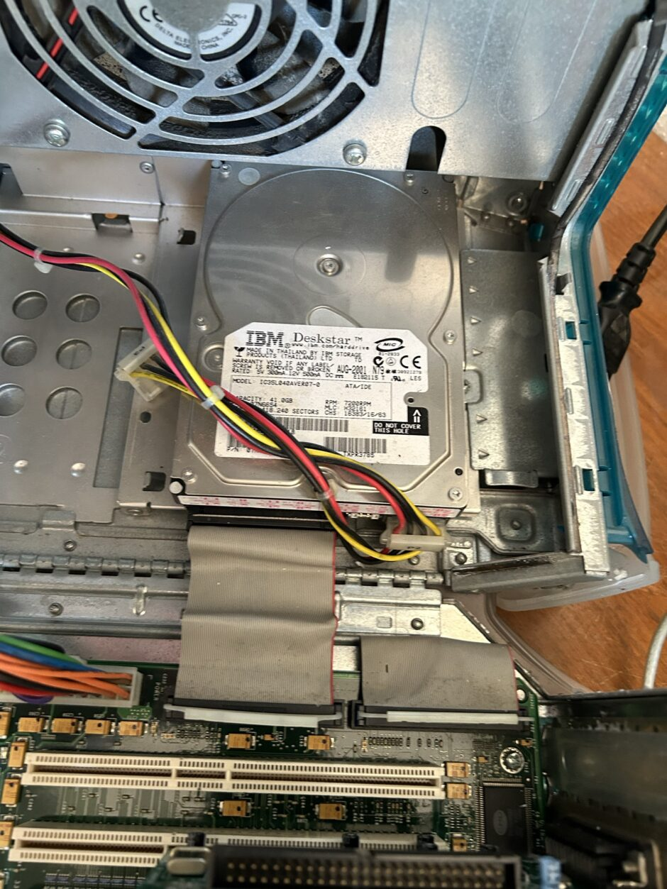<figcaption>The Original HDD</figcaption></figure>
    
-   <figure>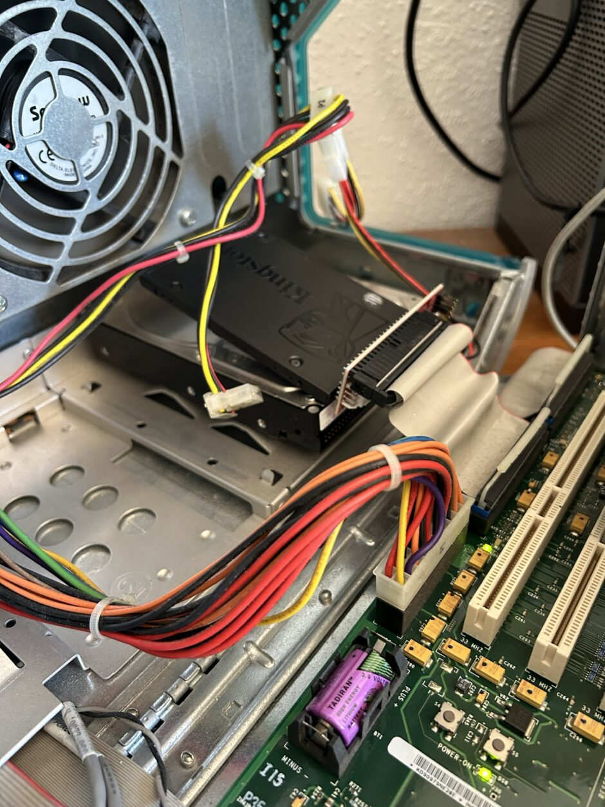<figcaption>The SSD Install on top of the Original HDD</figcaption></figure>
    
-   <figure>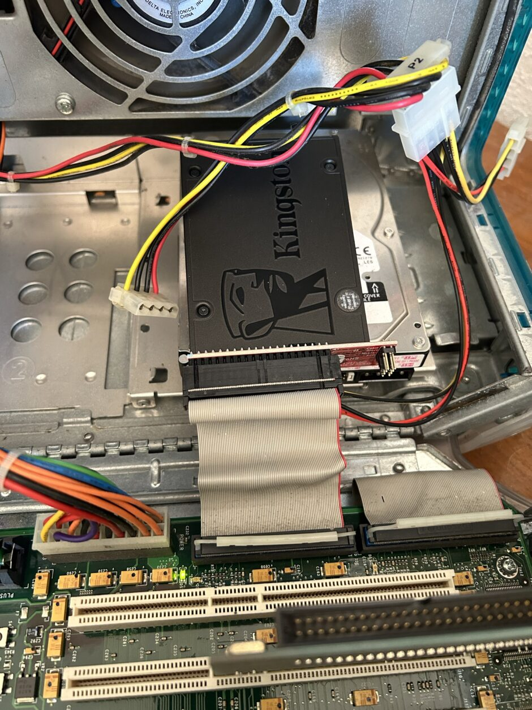<figcaption>The SSD Install on top of the Original HDD</figcaption></figure>
    
-   <figure>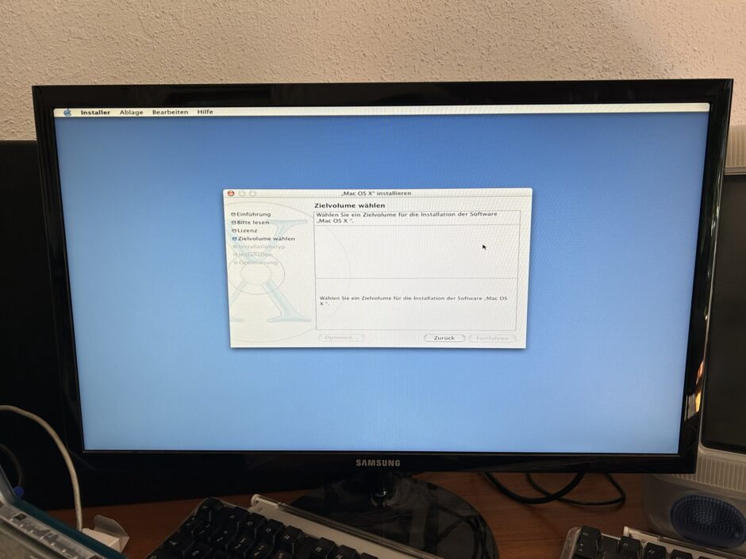<figcaption>The Jaguar Installer Can’t Find the SSD</figcaption></figure>
    
-   <figure>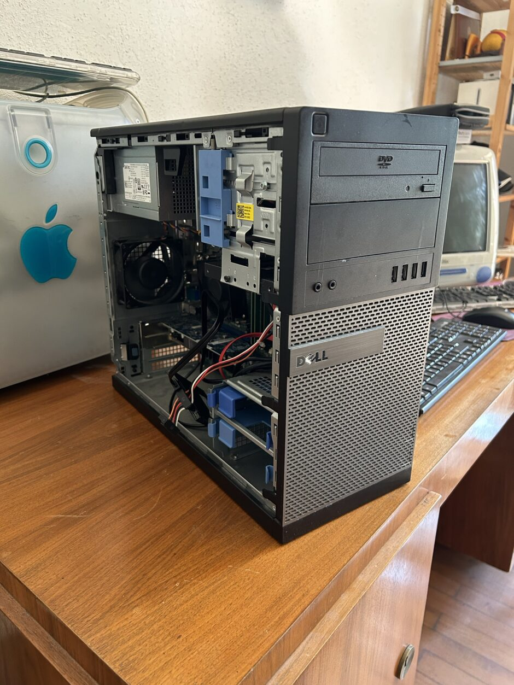<figcaption>My Hobby PC with the SSD Installed</figcaption></figure>
    
-   <figure>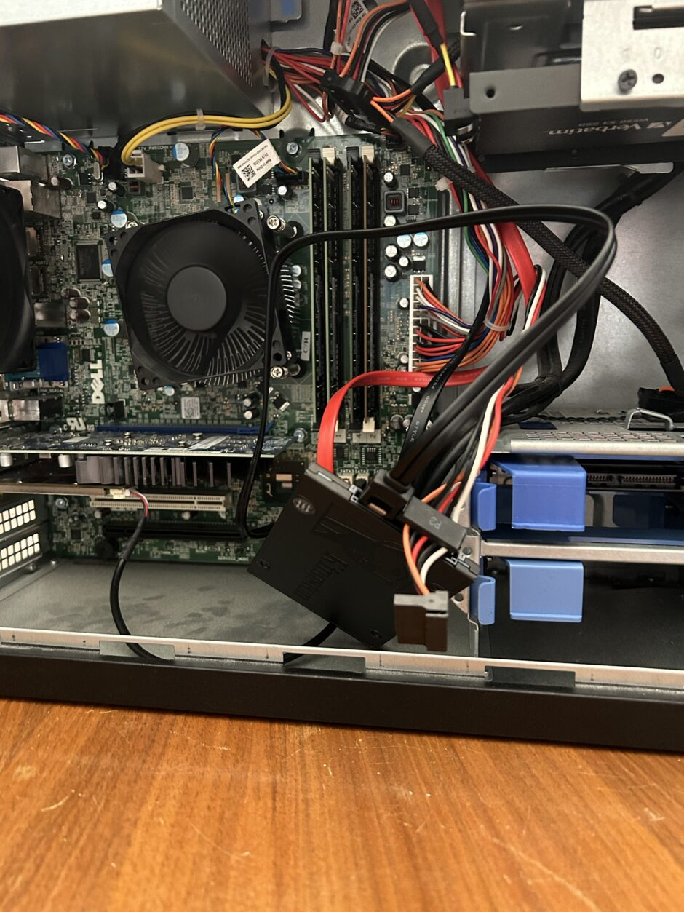<figcaption>The SSD in my Hobby PC Box</figcaption></figure>
    
-   <figure>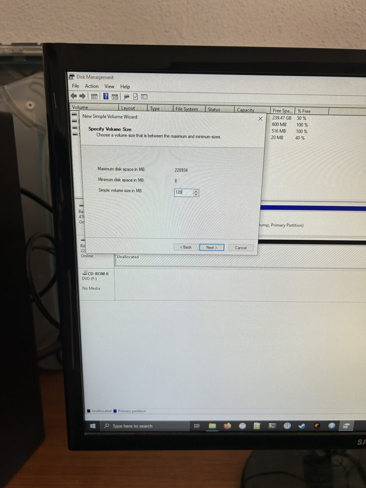<figcaption>Trying to Partition the SSD in Windows 10</figcaption></figure>
    
-   <figure>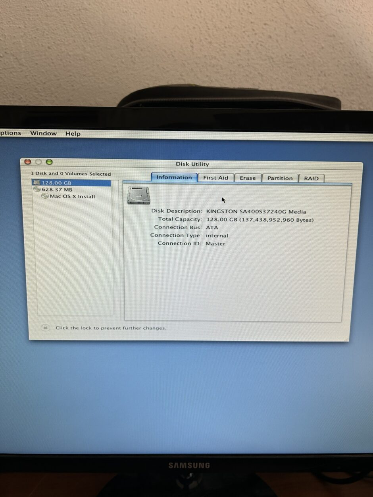<figcaption>Disk Utility Could See the SSD</figcaption></figure>
    
-   <figure>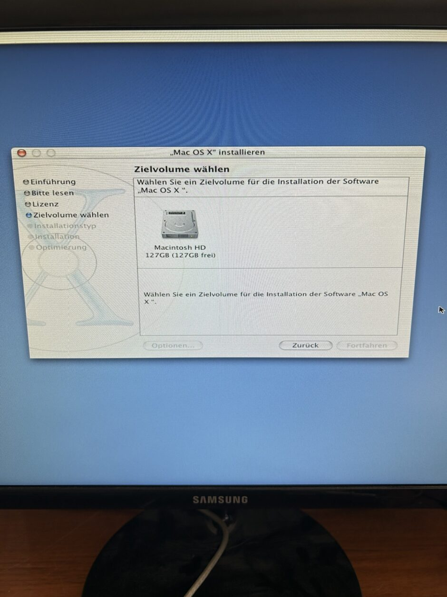<figcaption>The Mac OS X Installer Found the SSD</figcaption></figure>
    

Part 2
------

Originally, I was planning on making this a single post, but apparently, I have a lot more to write about than I thought so I’ve decided to break it up into multiple posts. There will probably be about three of them, but I can’t guarantee anything.

Now that the SSD is working, we’ll take a look at my adventures with trying to get Mac OS X 10.2 Jaguar installed on the system and why I chose that version of Mac OS. Getting it installed was more adventurous than it needed to be, but this time it wasn’t something I forgot to do.

*You can find Part 2 [here](https://blog.alexseifert.com/2024/05/04/my-new-powermac-g3-blue-and-white-part-2/).*