<figure>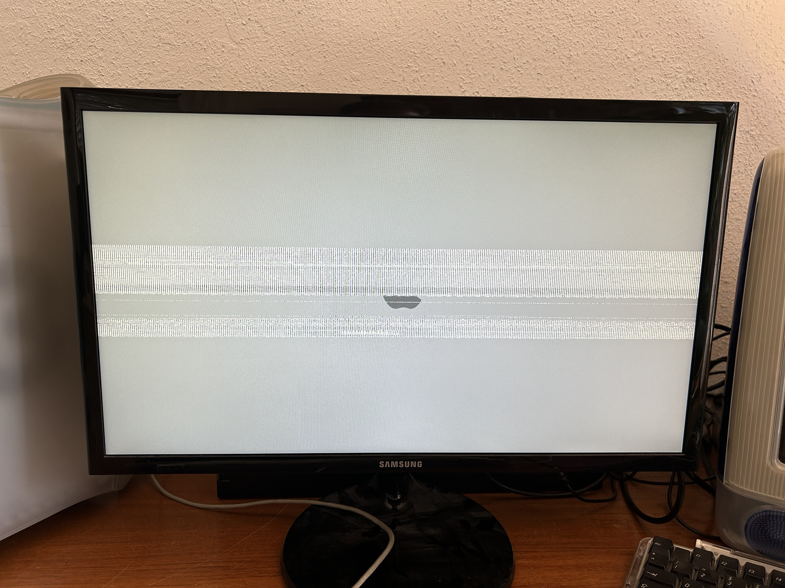<figcaption>Well… things are off to a great start.</figcaption></figure>

In [Part 1](https://blog.alexseifert.com/2024/04/17/my-new-powermac-g3-blue-and-white-part-1/), I introduced my new PowerMac G3 Blue and White and replaced the old hard drive with a brand new SSD. Not everything went as smoothly as I would have liked with the replacement, but I did manage to get it in and working. In this part, I will try to get Mac OS X 10.2 Jaguar installed which, as you may have surmised from the picture above, went about as smoothly as the SSD installation.

We left off where the Jaguar installer had just found the SSD after I had formatted it. Of course, I continued with the installation and was able to get through all the steps. The installer appeared to have installed everything correctly, even if it took a long time. I always forget how slow installing anything from a CD or DVD used to be.

Unfortunately, not everything made it to the SSD intact. After the installer restarted the computer, the computer froze and showed a glitchy screen as seen in the image above. I, again, went into troubleshooting mode. Reseating the VGA connector didn’t help and restarting the computer didn’t help either.

I didn’t spend too much time on it, however, because I figured that the CDs I had used to install Jaguar had simply degraded over the years. They were copies of the original Jaguar installation CDs I had burned in 2003. You can see a picture I took of them in the slideshow below:

-   <figure>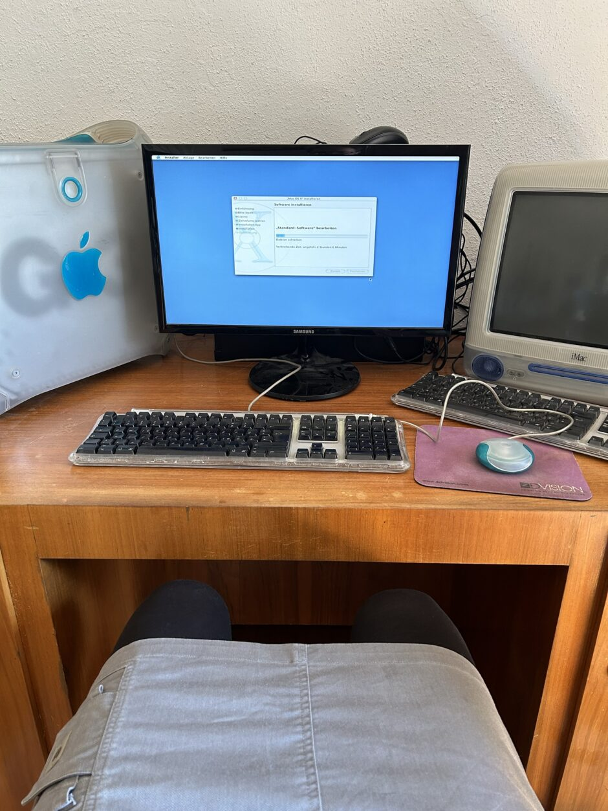<figcaption>Installing Mac OS X 10.2 Jaguar</figcaption></figure>
    
-   <figure>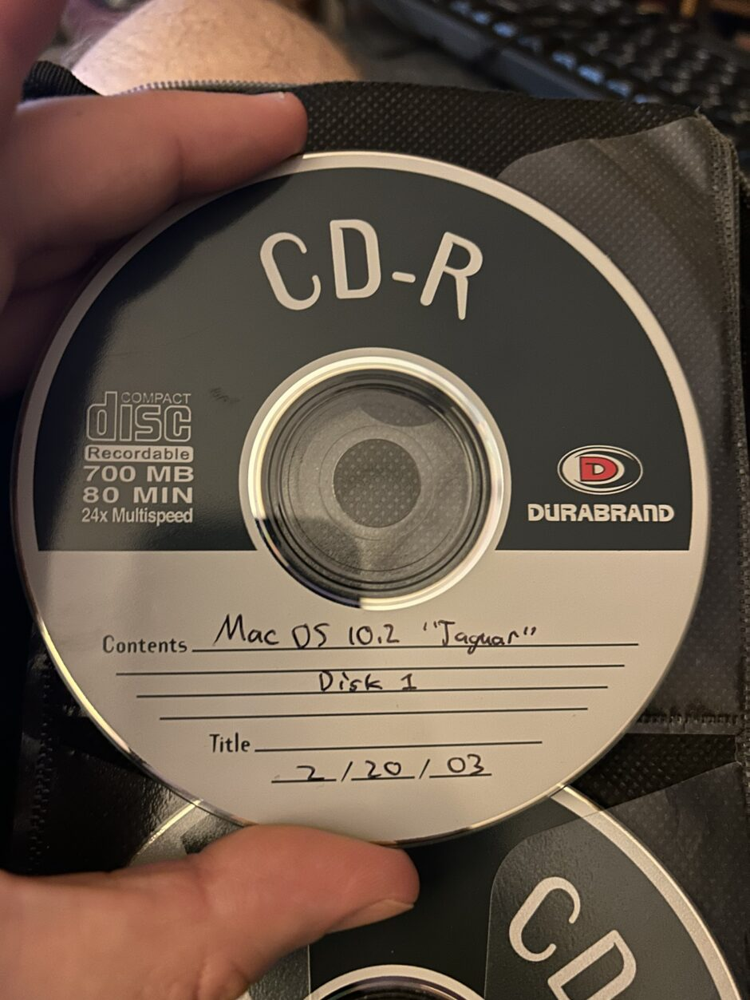<figcaption>The Install Disc for Mac OS X 10.2 Jaguar I Burned in 2003</figcaption></figure>
    
-   <figure><figcaption>Something With the Jaguar Installation Is Corrupt</figcaption></figure>
    

I didn’t have another copy of Jaguar lying around, so I couldn’t verify that was the problem right away. Instead, I did have an original Apple install CD with Mac OS 10.1 Puma that I got with my first iBook back in 2001. I don’t have the iBook anymore, but I kept the packet of CDs it came with which also included a Mac OS 9.2.2 installation disc and some other utilities and applications such as AppleWorks 6.

So, the next thing I decided to do was to try Mac OS 10.1 Puma. As with the Jaguar installation, I got through the process without a hitch. However, unlike the Jaguar installation, this one actually worked which more or less confirmed my suspicions that my burned Jaguar CDs were corrupt.

Back when Puma was new, I did actually use it on my iBook. As with most Mac users back then, I still primarily used Mac OS 9 since that was where the majority of Mac software was available. Puma included an integrated “Classic” mode which worked surprisingly well, but there wasn’t a whole lot of reason to switch to the new operating system full-time yet.

There was, however, a compelling reason not to switch. And that was the fact that although Puma was officially released as stable, it was still more or less beta quality. It didn’t take me long poking around Puma on my PowerMac to run into my first kernel panic. All it took was for me to try to open TextEdit. That’s it.

At that point, I hadn’t installed any software and the only file I had added was an MP3 of the song “Blue” by Eiffel 65 (both color and era-appropriate I thought). That meant that I was dealing with nothing but the stock installation. You can see some pictures of the installation process and the kernel panic below:

-   <figure>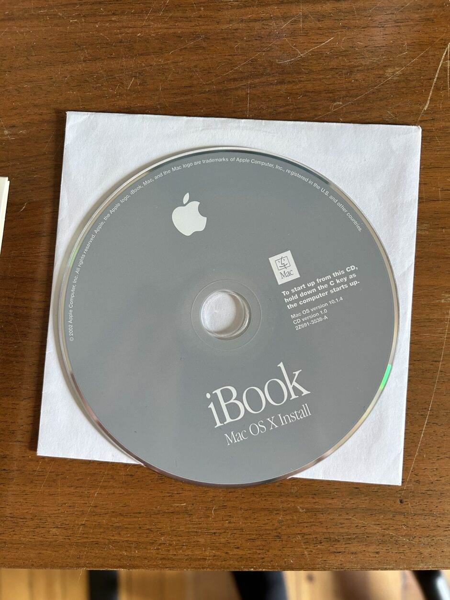<figcaption>The Mac OS X 10.1 Puma Installation CD from my Old iBook</figcaption></figure>
    
-   <figure>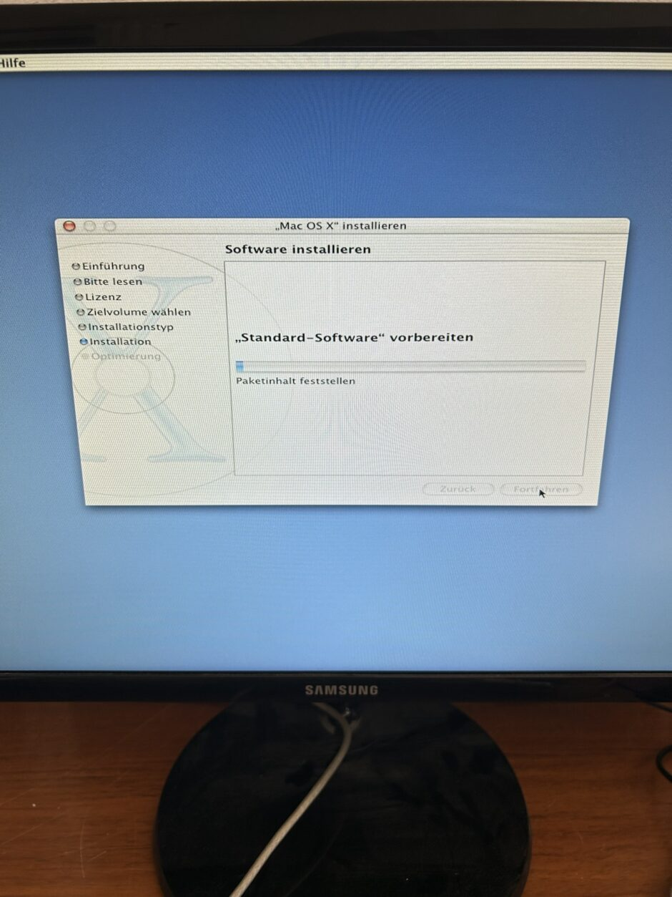<figcaption>Installing Mac OS X 10.1 Puma</figcaption></figure>
    
-   <figure>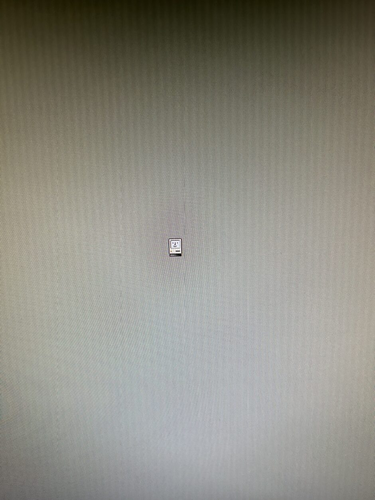<figcaption>Mac OS X 10.1 Puma Still Starts With a Happy Mac</figcaption></figure>
    
-   <figure>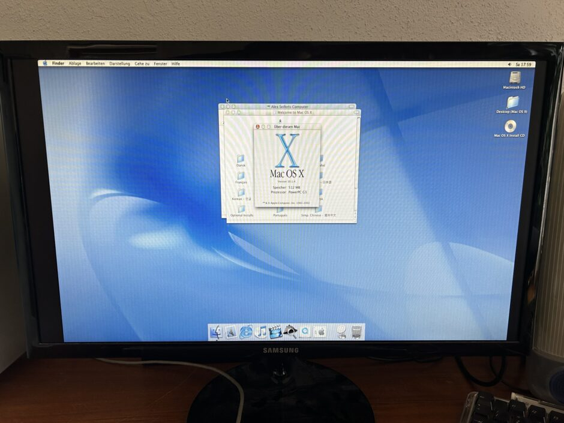<figcaption>Successful Mac OS X 10.1 Puma Installation</figcaption></figure>
    
-   <figure>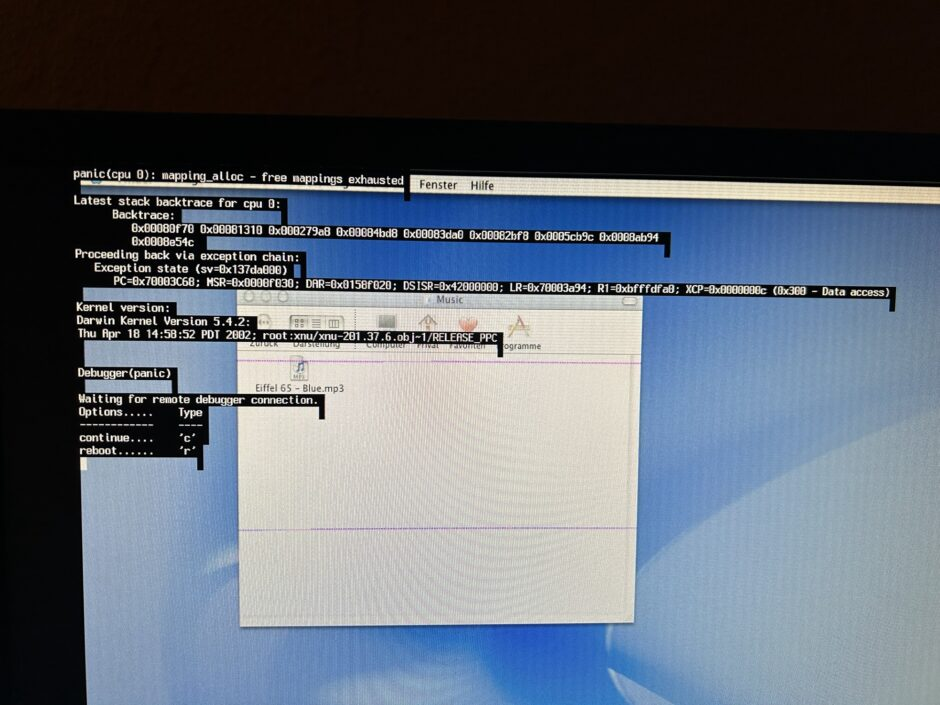<figcaption>Not All Is Right With Mac OS X 10.1 Puma</figcaption></figure>
    

The kernel panic that occurred while opening TextEdit didn’t give me much confidence in this version of Mac OS X, so I decided to go back to square one and install Mac OS 9. I didn’t think about using the original Apple installation disc I mentioned above because it took me days to get this far with my tight schedule and I had already put those CDs away.

So, I downloaded a copy of Mac OS 9.1 from [Macintosh Garden](https://macintoshgarden.org/), burnt it to a CD on my modern MacBook, stuck it in the CD drive, booted into the installer, reformated the drive for the third time, and installed Mac OS 9. As with the other installations, everything went as you’d expect and hope.

Mac OS 9 ran smoothly and stably. That was a primary reason why the transition to Mac OS X around the change of the millennium was so difficult for Apple: Mac OS X wasn’t particularly stable yet while Mac OS 9 was and this was very noticeable on my PowerMac.

I used this installation of Mac OS 9.1 to confirm that it wasn’t a hardware issue I was facing. I ran it for a while, installed some software, played some games, and generally tried to put the computer through its paces. It stayed entirely stable and didn’t crash even once. At that point, I figured, to my great relief, that my problems with Mac OS X were software-related and that the old hardware was still good.

At this point, I made another stupid decision. I decided to format the SSD for the fourth time and try the Jaguar installation *again*. It was known for being the first truly stable version of Mac OS X which is why I was so keen on getting it to run.

It was a stupid decision because it proved Einstein right when he said that the definition of insanity is doing the same thing over and over again and expecting different results. This time, the Jaguar installation didn’t even finish correctly. It froze and died installing printer drivers I didn’t need.

Obviously, something was wrong with the CDs, so I jumped on eBay and found several offers for original installation discs. I ordered a set (there were two CDs) for €32 including shipping. I was enticed by this offer because it also included an original CD with Apple’s Developer Tools for Jaguar.

Here are a few pictures of Mac OS 9.1 and my order for original Jaguar installation discs:

-   <figure>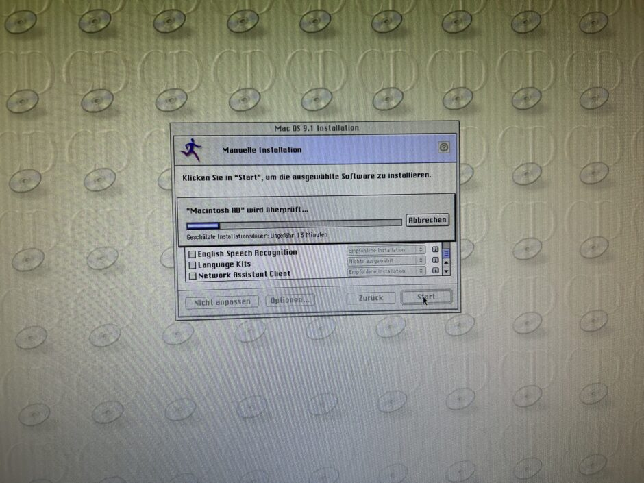<figcaption>Installing Mac OS 9.1</figcaption></figure>
    
-   <figure>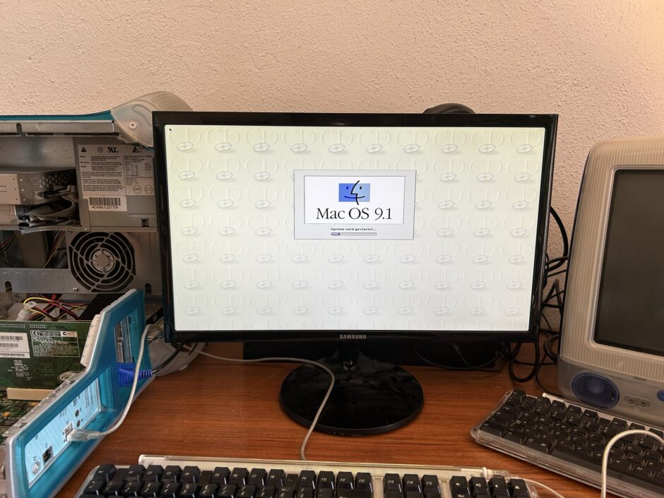<figcaption>Installing Mac OS 9.1</figcaption></figure>
    
-   <figure>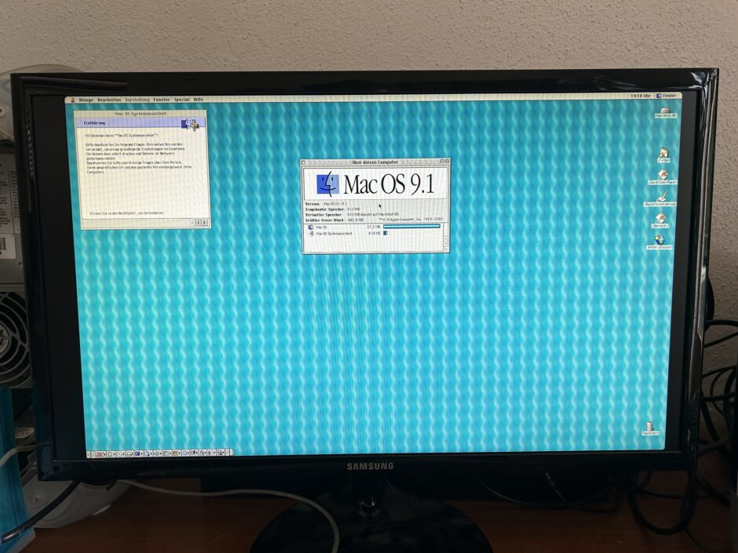<figcaption>Mac OS 9.1 Successfully Installed</figcaption></figure>
    
-   <figure><figcaption>My 20-Year-Old Burnt Jaguar CDs Might Be Bad</figcaption></figure>
    

In the meantime, I decided to format the SSD a fifth time and install Mac OS 9.2.2. As I mentioned above, the set of CDs that came with my old iBook also included an original Apple install disc for Mac OS 9.2.2, the latest version of Mac OS 9 released. This time, I remembered I had it and so, I decided to actually use it.

As with 9.1, 9.2.2 installed without a problem. Since I had to wait for my Jaguar installation CDs to come in, I decided to go ahead and start installing games and other software on the PowerMac. The plan was to leave Mac OS 9 and dual boot with Jaguar — something that was extremely common back when everything was new.

At this point, I was able to enjoy the fruit of my work for a few days without having to fix or troubleshoot any problems. I played several old games I used to enjoy like Tomb Raider I, Total Annihilation, Lighthouse, Railroad Tycoon II, and Civilization III. Some of them I downloaded from Macintosh Garden, but most of them I had original CDs for.

Here are a few pictures related to Mac OS 9.2.2:

-   <figure>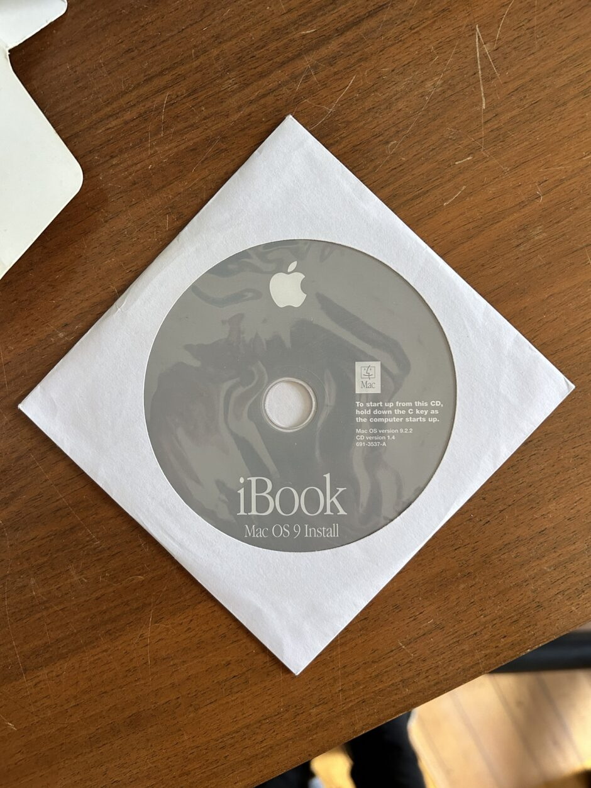<figcaption>The Mac OS 9 Installation Disc That Came With My iBook</figcaption></figure>
    
-   <figure>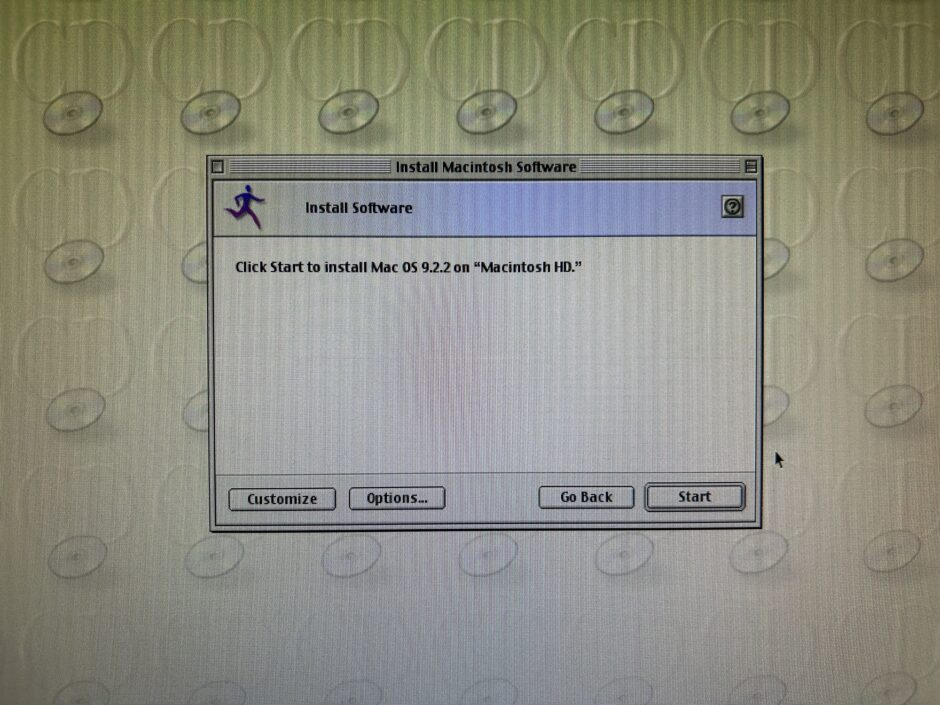<figcaption>About to Install Mac OS 9.2.2</figcaption></figure>
    
-   <figure>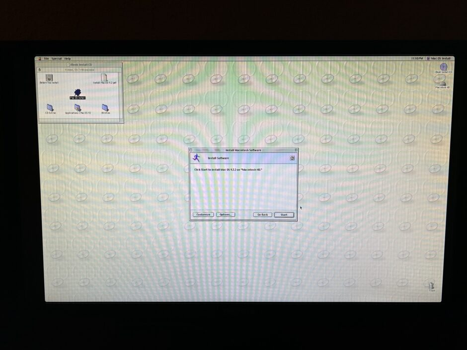<figcaption>About to Install Mac OS 9.2.2</figcaption></figure>
    
-   <figure>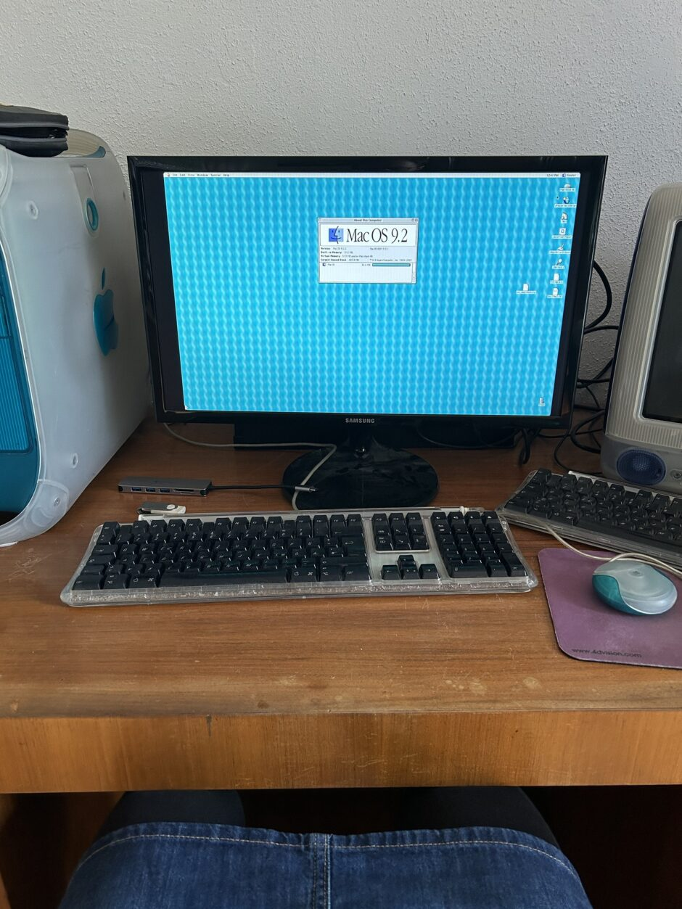<figcaption>Mac OS 9.2.2</figcaption></figure>
    
-   <figure>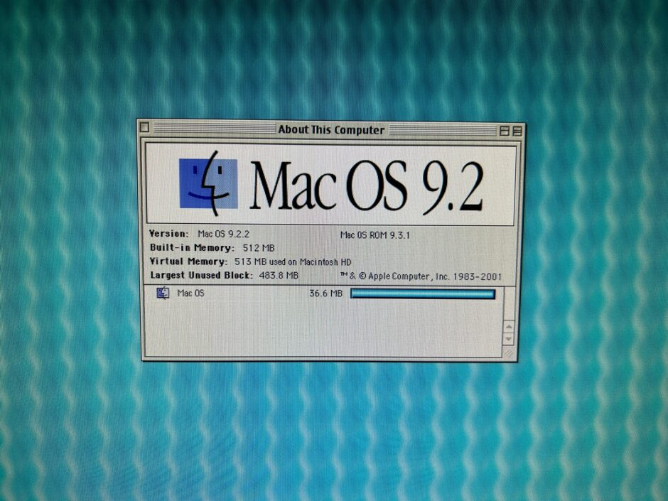<figcaption>Mac OS 9.2.2</figcaption></figure>
    

The story doesn’t end there, however. Less than a week later, the Jaguar installation CDs arrived. That meant it was time to dive back into the fun of installing operating systems once again. What was different this time though is that I didn’t have to format the SSD since, as mentioned above, I wanted to dual boot.

When the CDs came in, I was excited to start, so I booted up the computer, threw CD 1 in, and started the installation process, but surprise! There was a problem. I had accidentally ordered an upgrade version of Jaguar rather than the full version.

Fortunately, it was easy to overcome. I got out the Puma installation disc again and installed it once again. Once it was installed, I booted into it and luckily it didn’t have another kernel panic when I inserted the Jaguar upgrade CD. I was able to start the Jaguar installation from there.

This time, it installed smoothly and even booted right up once the installation was complete. There was not a single problem! I was anticipating more issues, so this came as somewhat of a surprise. I was even able to get Classic mode working and the developer tools installed to play around with. I was also still able to boot into Mac OS 9.2.2 without issue which I was extremely excited about.

You can see some pictures of it all below:

-   <figure>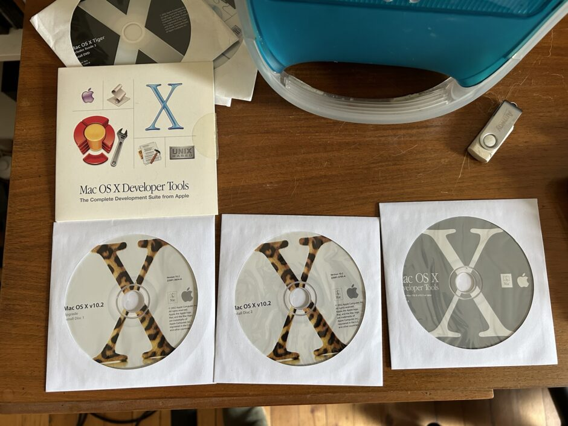<figcaption>Original Mac OS X 10.2 Jaguar Installation CDs</figcaption></figure>
    
-   <figure>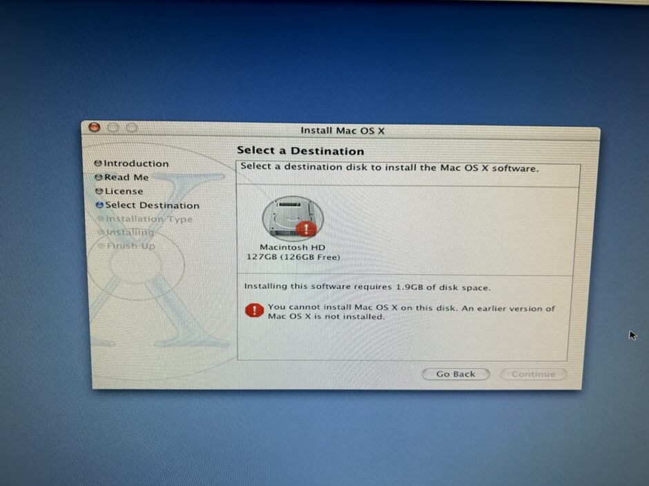<figcaption>The Jaguar Installation CDs Are Upgrade CDs</figcaption></figure>
    
-   <figure>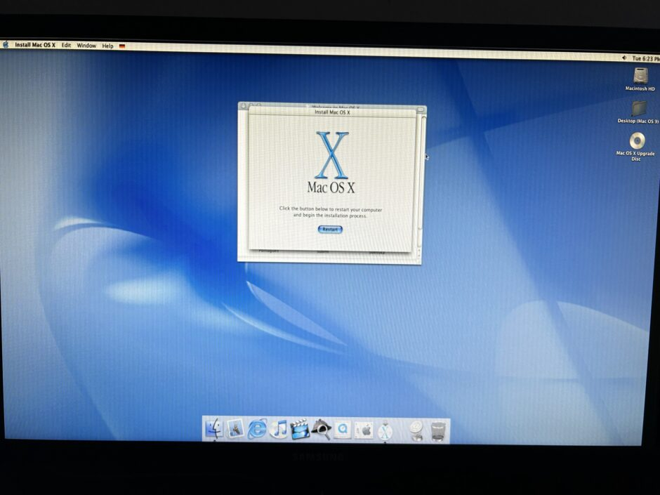<figcaption>About To Upgrade Mac OS X 10.1 Puma to 10.2 Jaguar</figcaption></figure>
    
-   <figure>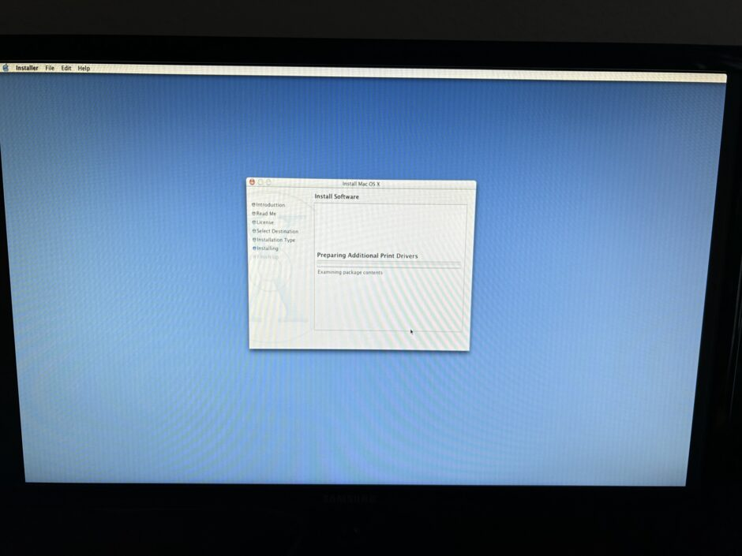<figcaption>Installing Mac OS X Jaguar 10.2 Using Original Apple CDs</figcaption></figure>
    
-   <figure><figcaption>Mac OS X Jaguar 10.2</figcaption></figure>
    
-   <figure><figcaption>Starting the Classic Mode on Mac OS X 10.2 Jaguar</figcaption></figure>
    
-   <figure><figcaption>SimpleText Running in Classic Mode on Mac OS X 10.2 Jaguar</figcaption></figure>
    
-   <figure>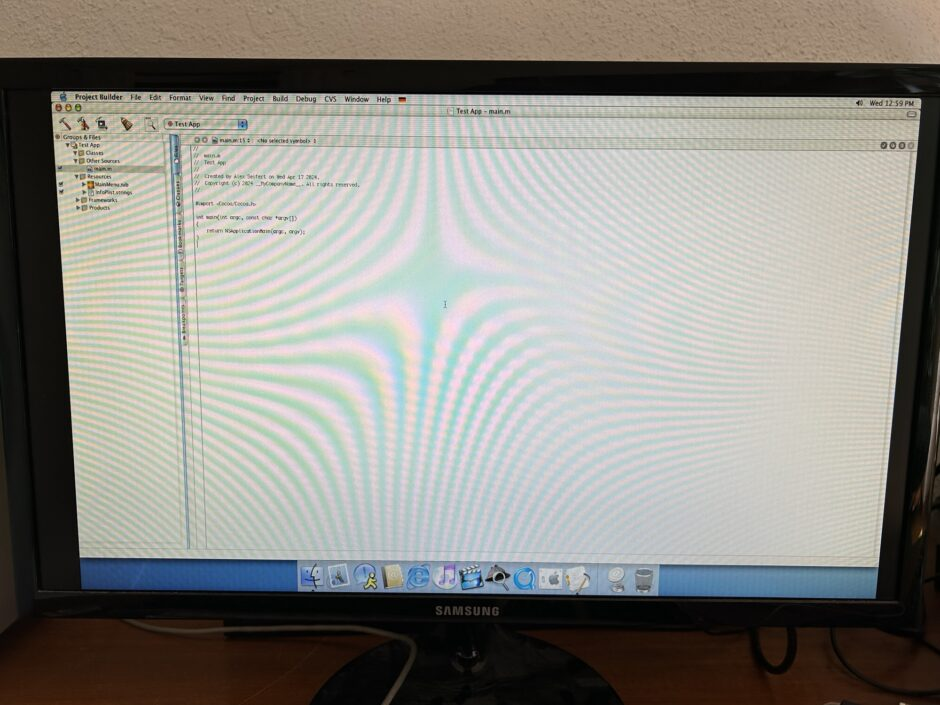<figcaption>Apple Developer Tools for Mac OS X 10.2 Jaguar (Before Xcode)</figcaption></figure>
    
-   <figure>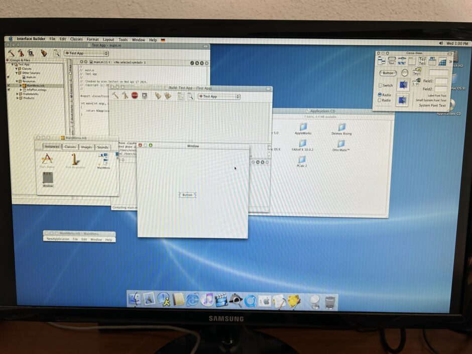<figcaption>Apple Developer Tools for Mac OS X 10.2 Jaguar (Before Xcode)</figcaption></figure>
    

So after weeks of troubleshooting, I finally had a working version of Mac OS X Jaguar 10.2 on my PowerMac G3 Blue and White. Of course, I installed some Mac OS X-only software and games on it. It hasn’t crashed once which just shows how much more stable Jaguar was than its predecessor, Puma.

It didn’t take me long, however, to remember another one of the reasons why Apple’s transition to Mac OS X was so rough: it is so much slower than Mac OS 9. Everything takes noticeably longer, even basic tasks like opening windows in Finder. The animations are present, but not particularly smooth and it just generally feels a little like computing in molasses despite the PowerMac’s specs being *way* over Jaguar’s minimum requirements.

In the end, I am excited that I got it working and the trip down memory lane has been both exciting and frustrating. I remembered old problems I had suppressed while, at the same time, recalled things that excited me about Mac OS X back when it was new.

For the most part, I’ve found that despite all I went through to get Mac OS X Jaguar installed, I mostly still use Mac OS 9 — just like back around the turn of the millennium. It runs more smoothly and most of the software from the period works with it.

In either case, I enjoyed the journey and am excited about being able to fire up either version of Mac OS at any time I wish. The project was at times annoying, but I had a lot of fun nonetheless. I regret nothing.