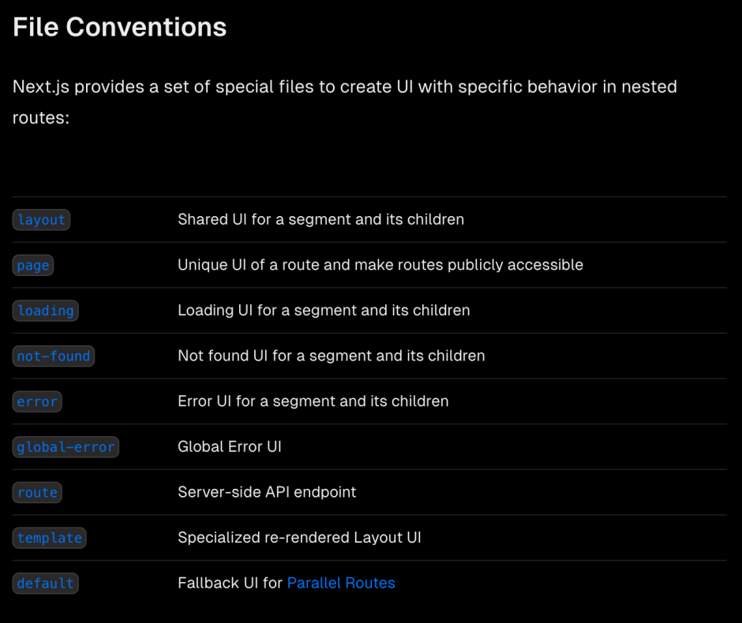

<figure></figure>

When I first discovered [Next.js](https://nextjs.org/), I was extremely excited about its possibilities. It has, however, in my opinion become somewhat of a mess since I first discovered it which has led me to look at other frameworks to fulfill my SEO-friendly single-page application (SPA) needs.

When I first came across it, I was learning React and was looking for a way to create an SEO-friendly website using the library. By that time, I had done years of frontend (and backend) development but had only ever done traditional frontend work for multipage applications (MPA) with server-side rendering.

Since I was enjoying the new-to-me experience of developing using SPA technology, I decided to rewrite [my online portfolio](https://www.alexseifert.com) using React. In order to do that though, I needed it to be SEO-friendly which is why I chose Next.js.

What I Liked About Next.js
--------------------------

There were a lot of features about Next.js that I liked. Its file system-based routing was easy to use, it offered static page generation as well as incremental page regeneration which was and still is a key feature for me.

Most of my portfolio page is static and only needs to be rebuilt when the application is redeployed, but a few key pages such as my [Blogs](https://www.alexseifert.com/blogs/) page need to be incrementally regenerated when external content is updated.

Generally, the project had the right feature set for me, it was easy to understand and implement, and it just worked well. And it still does as long as you ignore the new “[app router](https://nextjs.org/docs/app/building-your-application/routing#the-app-router)“, but more about that later.

Once I realized that an SEO-friendly SPA framework existed, I thought I would look around to see what else was available. Originally, I looked at both Next.js and Nuxt.js. For those who don’t know [Nuxt.js](https://nuxt.com/), it’s basically the Next.js-equivalent for Vue.

In the end, I decided on Next.js because I was already learning React, didn’t feel like learning Vue on top of it, and it seemed like Next.js was the more mature framework with more features. This was 2019, so things have obviously changed a lot. Nuxt.js has matured greatly since then, but that is beyond the scope of this post. For now, we’re going to focus on Next.js.

What Has Changed: The App Router
--------------------------------

I already hinted about what I dislike about how Next.js has developed above: the new app router. That isn’t the only change I don’t like, but it’s the primary one. If you don’t know what I’m talking about, take a look at the [documentation](https://nextjs.org/docs/app/building-your-application/routing#the-app-router).

I understand that they conceptualized it to work with the new server component feature coming from React, but I don’t care much for that either. I have dug into the documentation and have experimented with them using both plain React and Next.js and I just can’t warm up to them.

The reason is simple: they introduce a new level of chaos to an already chaotic library. Even with years of professional experience working on React projects, hours and hours of training, and a pretty deep understanding of it, I can’t help but feel like React is chaotic. Every project I have worked on has had crippling problems with organization and convention that cannot be solved by pull requests, linting, or team agreements forgotten about buried somewhere on a Confluence page written after a meeting two years ago.

Next.js does try to reign in this chaos problem by forcing developers to use certain file conventions and structures, but the new app router takes it to such an extreme that it actually restricts what is technically possible to create with the framework. I will get to that in a little bit though.

The new app router works with file name conventions and each level deeper in the file system overrides the previous level. If you don’t know what I’m talking about, take a look at this list from the Next.js [documentation page](https://nextjs.org/docs/app/building-your-application/routing#roles-of-folders-and-files):

<figure><figcaption>Next.js App Router File Conventions</figcaption></figure>

This may seem great at first because it forces naming conventions, but trying to find an elusive bug through several levels of this is a nightmare.

I know this is by design to compartmentalize and modularize routes so that you can have deeply-nested routes and only change subsections with their own custom loaders, etc when the route changes. I really do get the idea behind it and the concept itself really isn’t bad if that’s what you’re going for.

However, the way I work and plan application architecture just isn’t compatible with that kind of thinking. I have seriously tried, but it just won’t happen. I know that sounds like a personal problem, but it’s mainly due to the technical limitations this structure introduces.

Limitations
-----------

Using the new app router always ends in frustration for me because I keep running into its limitations and feel too constricted by it. It’s not the file structure and opinionated approach to React that makes me feel this way. In fact, I welcome that very much for React projects since, as mentioned above, most projects are utterly chaotic.

Instead, it’s the fact that it’s technically not possible to program certain features into the application with the app router. If this is the future of Next.js, then it feels like they are cutting themselves short and removing a lot of flexibility from their framework.

One such example is with route events. In the old page router, it is possible to subscribe to route events that allow you to perform an operation when, for example, a route change is triggered and another when a route change is over.

Among other things, this allows you to display a global loader for when new pages are loaded. This is important to be able to do because when a user’s internet connection isn’t particularly fast or flakey, the files for the page being navigated won’t be loaded instantaneously. If you don’t display some sort of loader, it will appear as though the application is unresponsive.

The convention for SPAs has become a loading bar across the top of the page and it’s what users are used to. UI/UX designers also like this convention so it is not uncommon to see when you get ready to implement a new design. The new app router, however, does not allow you to do this because you cannot subscribe to the route change events.

As of publication, there is a long, ongoing [discussion about it on GitHub](https://github.com/vercel/next.js/discussions/41934). Vercel (the company behind Next.js) may resolve this, but then again, they may not.

Of course, anyone familiar with the new app router will point out the “loading.{jsx,tsx}” file convention that can be seen in the screenshot above. This will indeed automatically show a loader when a new route is being loaded, but it replaces the router outlet’s entire contents before replacing it again with the new content. That means you can use it to show loading skeletons or maybe a spinning wheel which is fine for small components that need to load, but is a horrible user experience when changing entire pages.

The entire page disappears to show some sort of loader and then reappears which means the user sees two page changes rather than only one. In the best-case scenario, that’s a terrible user experience and in the worst-case scenario, it may lead to confusion about what the application is actually doing.

Essentially, it forces you into this design pattern whether you like it or not. The developer and/or UX/UI designer is no longer given the flexibility to design the user experience to their heart’s content. It is a heavy-handed, top-down approach that forces application developers and designers to conform to Next.js’s paradigm.

Another limitation that comes to mind by not being able to subscribe to routing events is that you are prevented from stopping navigation when, say, the user has unsaved changes and you want to warn him before he loses them by changing pages.

Conclusion
----------

In the end, developers have to choose the framework and tools that work best for their project. There are certainly some valid use cases for the new app router in Next.js, but I find it way too restricting. I don’t like where the development is going.

You might mention that there is still the page router that takes care of all of my complaints above and you would be right. However, I am hesitant to start a new project with it because it is clear that the app router is the future, and who knows when the page router will be deprecated.

Some of what I’ve written may sound as though I’m against all progress in the SPA world. I can say with certainty that I am not. The problems that Next.js is trying to solve are very real issues that need to be addressed. I just don’t like the approach that Next.js has taken.

Since then, I have looked at other options such as Nuxt.js and Angular Server-Side Rendering (SSR). Angular SSR is a great option for completely static sites but lacks incremental regeneration. They made great progress with Angular 17 (the latest release) and I hope that Angular 18 will bring incremental regeneration.

So that leaves Nuxt.js, which, as of this writing is now my go-to SEO-friendly SPA framework. Since learning React, I have also learned and worked with Vue which means that is no longer a barrier. I have even [written about it](https://blog.alexseifert.com/2023/05/10/vue-js-route-level-code-splitting-with-a-page-loader/). It has all of the features I need and I haven’t run into any limitations as to what it can do yet.

That said, I am tired of the constant framework rollercoaster and am starting to think that a good, old-fashioned, stable-as-hell, boring, multipage application is the future of my projects. Maybe it’s age or perhaps I’m just ready to get more done rather than having to constantly battle the tools that should make my life easier.

*What do you think about Next.js and its recent developments? What SPA frameworks do you use? How about MPA frameworks? Let me know in the comments!*