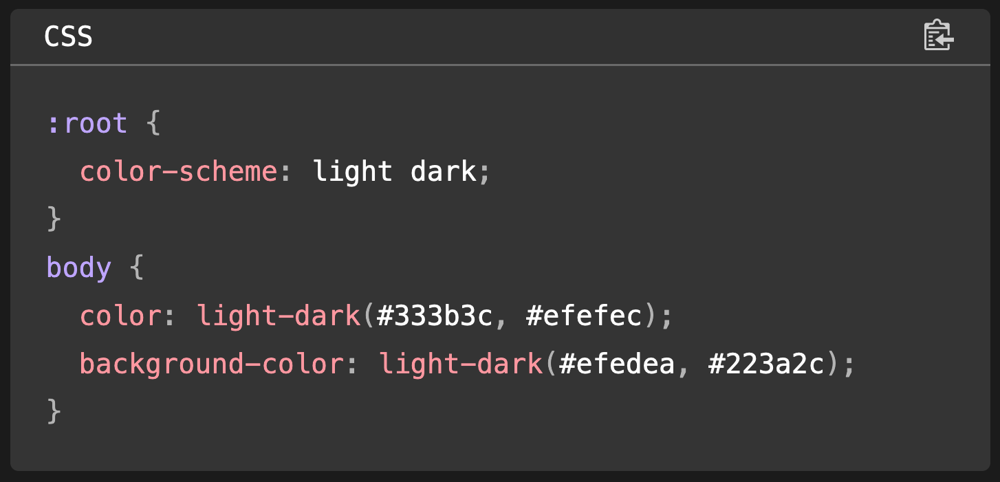
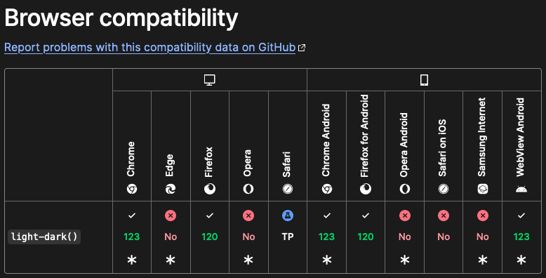

<figure><figcaption>CSS light-dark() function</figcaption></figure>

A few days ago, I stumbled across a new function in CSS that is going to make my life a tremendous amount easier: light-dark(). This function will enable developers to define both light and dark colors for a property in a single line without media queries.

Most websites I have worked on in the past several years have supported both light and dark modes based on the user’s preference. So far, I’ve achieved this by using the [prefers-color-scheme](https://developer.mozilla.org/en-US/docs/Web/CSS/@media/prefers-color-scheme) media condition like in this example:

```css
.example {
  color: #000000;

  @media (prefers-color-scheme: dark) {
    color: #ffffff;
  }
}
```

This works but requires several extra lines of code. The new light-dark() function will turn this into one-liner:

```css
.example {
  color: light-dark(#000000, #ffffff);
}
```

So much cleaner and easier to read! That is especially the case if you have a large CSS class with multiple properties. The only prerequisite is that you set the color scheme in :root so that the browser knows your website supports both light and dark modes.

Here is the complete example:

```css
:root {
  color-scheme: light dark;
}

.example {
  color: light-dark(#000000, #ffffff);
}
```

Once you’ve set color-scheme, you can use the light-dark() function anywhere in your CSS code.

The function is still relatively new and is therefore not available yet in every browser. I suspect it won’t take long for the holdouts to support it though since Google Chrome already supports it and Edge and Opera are also based on Chromium. Firefox supports it already and it’s already in development for Safari. You can see the [browser compatibility list](https://developer.mozilla.org/en-US/docs/Web/CSS/color_value/light-dark#browser_compatibility) from MDN here:

<figure><figcaption>Browser compatibility for light-dark()</figcaption></figure>

I am certainly looking forward to being able to write clearer, more concise CSS in the future using light-dark(). If you would like to read more details about it, there are a couple of links below.

Links
-----

-   [CSS color-scheme-dependent colors with light-dark()](https://web.dev/articles/light-dark) on web.dev
-   [light-dark() on MDN](https://developer.mozilla.org/en-US/docs/Web/CSS/color_value/light-dark)