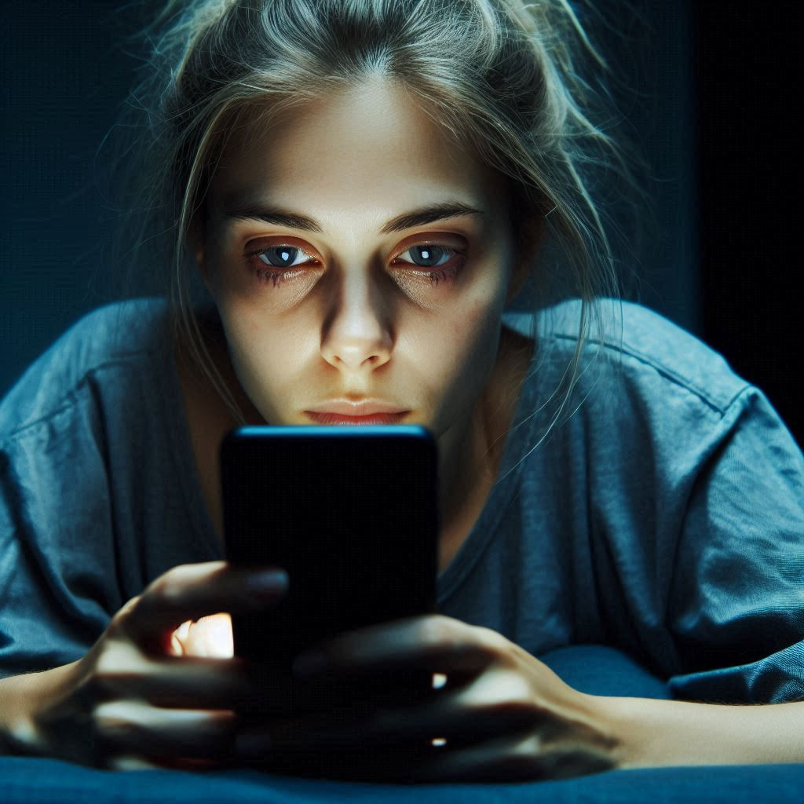

<figure><figcaption>AI-generated image of a tired woman staring into her phone at night</figcaption></figure>

In the past several years, there has been a lot of hype about how blue light from screens affects our sleeping patterns. As a result, “night modes” have been introduced to our devices which reduce the amount of blue light they emit and products, such as glasses with blue light filters, have shown up on the market.

They all claim to do one thing: mitigate the blue light problem. But as it turns out, this “problem” isn’t really much of one.

I recently stumbled upon an [article about the subject](https://theconversation.com/how-much-does-your-phones-blue-light-really-delay-your-sleep-relax-its-just-2-7-minutes-236066) on [The Conversation](https://theconversation.com) which is an online publication whose sole contributors are academics. This is what the authors did:

> We gathered evidence from 73 independent studies with a total of 113,370 participants of all ages examining various factors that connect technology use and sleep.
> 
> We did indeed find a link between technology use and sleep, but not necessarily what you’d think.
> 
> We found that sometimes technology use can lead to poor sleep and sometimes poor sleep can lead to more technology use. In other words, the relationship between technology and sleep is complex and can go both ways.
> 
> [The Conversation](https://theconversation.com/how-much-does-your-phones-blue-light-really-delay-your-sleep-relax-its-just-2-7-minutes-236066)

In other words, blue light isn’t the problem. It’s how often we use the technology that’s actually hurting our sleep.

You might be wondering, then, why the blue light emitted from screens isn’t the issue even though we know blue light has a direct impact on the level of melatonin in your body. Well, they have an explanation for that too:

> The blue light theory involves melatonin, a hormone that regulates sleep. During the day, we are exposed to bright, natural light that contains a high amount of blue light. This bright, blue light activates certain cells at the back of our eyes, which send signals to our brain that it’s time to be alert. But as light decreases at night, our brain starts to produce melatonin, making us feel sleepy.
> 
> It’s logical to think that artificial light from devices could interfere with the production of melatonin and so affect our sleep. But [studies](https://www.ncbi.nlm.nih.gov/pmc/articles/PMC6814154/) [show](https://doi.org/10.1093/sleep/16.5.436) it would require light levels of about 1,000-2,000 lux (a measure of the intensity of light) to have a significant impact.
> 
> Device screens emit only about [80-100 lux](https://www.tandfonline.com/doi/full/10.3109/07420528.2013.872121). At the other end of the scale, natural sunlight on a sunny day provides about [100,000 lux](https://www.ncbi.nlm.nih.gov/pmc/articles/PMC6814154/).
> 
> [The Conversation](https://theconversation.com/how-much-does-your-phones-blue-light-really-delay-your-sleep-relax-its-just-2-7-minutes-236066)

That means screens don’t even come close to emitting the amount of blue light necessary to have much of an impact on the level of melatonin in your body. I say “much of an impact” because they still found that participants in the studies who used screens right before bed fell asleep an average of 2.7 minutes later than those who did not. So while it might have a tiny effect, it’s negligible.

So keep on using those devices right up until you go to sleep, skip using “night mode”, and save your money by not buying glasses with a blue light filter. It’s really not going to matter.

Here is the link to the original article: [https://theconversation.com/how-much-does-your-phones-blue-light-really-delay-your-sleep-relax-its-just-2-7-minutes-236066](https://theconversation.com/how-much-does-your-phones-blue-light-really-delay-your-sleep-relax-its-just-2-7-minutes-236066)