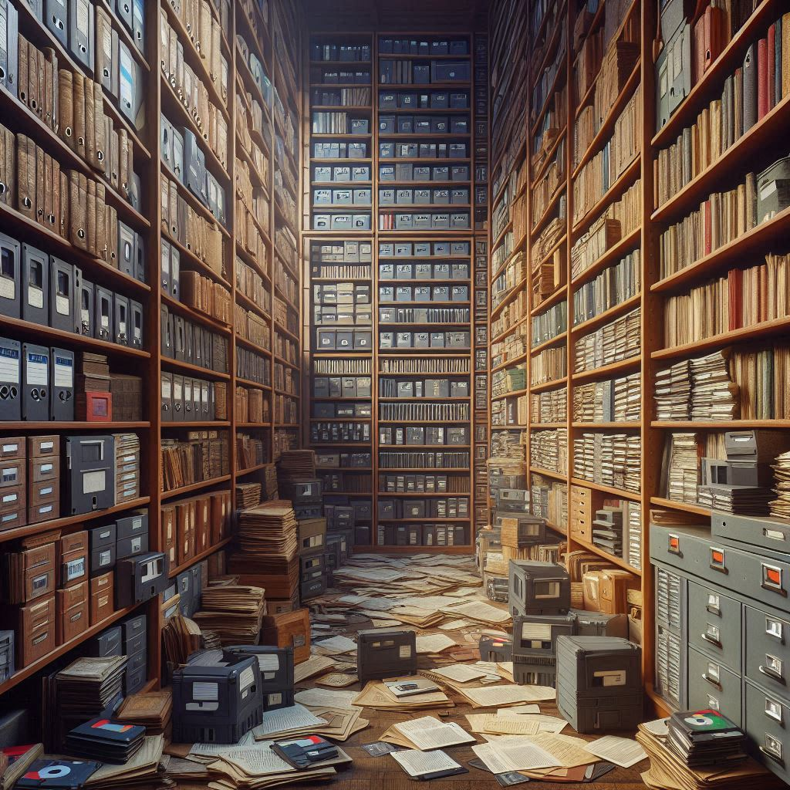

<figure><figcaption>AI-generated image of shelves full of paper, books and floppy disks</figcaption></figure>

I recently ran into [a blog post on another blog](https://lilysthings.org/blog/no-data-lasts-forever/) titled “No Data Lasts Forever.” As the name implies, it discusses the longevity of the existence of not only digital data but also other forms such as stone, papyrus and paper.

I found the post interesting and worth writing about on my blog because it is a topic I have also given a lot of thought into myself. One of my degrees is in history, and using, archiving and preserving old documents is a large part of a historian’s job, so I do have some experience in that area. On top of that, I produce a lot of written content between all of [my various blogs](https://blog.alexseifert.com/other-blogs/), have composed and recorded [several music albums](https://www.alexseifert.com/hobbies/music/), and have also [produced a ton of code](https://github.com/eiskalteschatten?tab=repositories) in my free time.

All of this has driven me to think about how long it will last. The content I produce is almost exclusively digital and of course, no one really knows how long digital data can be preserved. Data corruption is always a looming specter while the largest threat is probably the availability of software and technology to access that data.

Most programs use proprietary formats to save the data they produce. This means that once those programs are no longer supported or are no longer able to be run, the potential for data loss is massive.

So how can you ensure your digital data will last as long as possible? That is a difficult question to answer as no response can be a guarantee. However, there are a few things you can do to make sure it’s at least as accessible for as long as possible.

Attempting to Preserve Digital Data
-----------------------------------

The first item to mention is to make your data as universally accessible as possible. What I mean by this is that a person should be able to open it on any platform using a wide range of programs. A great example of this is text files. It doesn’t matter if the extension is .txt, .html, .md or any other format, these files can be opened on any platform using a huge variety of programs.

Plain text is also so widespread that the likelihood of it not working in the future is minimal. There are other formats that you could probably lump into that category as well, but they may not have quite the same ultra-high chances. Examples are Microsoft Word documents (.doc/.docx), PDFs (.pdf), various image formats (.jpeg/.jpg, .png, .gif), etc. These are ubiquitous in modern computing and also openable by a plethora of different applications on a variety of platforms. The risk though is that there might be compatibility problems with, say, opening a .docx file in LibreOffice which means the original might not be perfectly preserved. Even a new version of Microsoft Word itself might not be able to open and older file properly anymore.

It also goes without saying that you need to make sure you have backups: onsite as well as offsite. Those backups will help with preservation for anyone that has access to them, but if you are creating works that you want available to the public (such as this blog), then it makes sense to also have public backups so that the content will continue to be accessible in the future.

I have done exactly that with my blogs by creating a script that exports the content using the WordPress API, converts it to Markdown (plain text) and pushes it to a public repository on GitHub. There is one repository per blog and I have the backup script running once every evening. You can read more about it in [the post I wrote about](https://blog.alexseifert.com/2024/10/18/archiving-my-blogs/).

The point I am trying to make with this though is that GitHub will most likely be around a lot longer than this blog which is self-hosted on a rented virtual server. I also intend to push the content to other git hosting services such as GitLab, but haven’t gotten around to it yet.

Of course, I am under no illusion that GitHub, GitLab or any other company is going to be around forever which leaves the question: What happens when they’ve all shut down? Well, the bad news is that if you want something to be public, you have to rely on someone to host it. That’s especially true for the long-run. Even sites like the [Internet Archive](https://archive.org/) whose sole purpose is to, well, archive the internet probably won’t be around for very long in the grand scheme of things.

Other Options
-------------

So, if you can’t entirely rely on someone else to host your content forever, how do you preserve it for as long as possible? Well, for one, you’ll probably have to forego having it archived publicly. You can certainly make as many copies as possible on various types of media such as CDs or DVDS, but even those decay in only a matter of decades which really isn’t very long at all if you consider the fact that we still have hieroglyphics carved into stone that are thousands of years old.

I’m afraid the only answer I can think of to that question is to just simply print it out. Paper doesn’t last forever either, but it is at least a known quantity and, if taken care of properly, can last for centuries. We still have plenty of paper documents that date back to the dark ages and beyond.

Is it realistic to print everything out? Probably not. I’m certainly not going to bother doing that with my blogs and even if I did, it would only be for the posts that I consider to be the best. I do, however, [keep a daily journal](https://blog.alexseifert.com/2023/02/12/my-daily-journaling-habit/) which I always have a hard copy of. Some years I’ve handwritten it in a notebook while others, I’ve typed it and printed it out at the end of each year. The journal isn’t just intended for me though, but also for my son, his children, their children, etc. That’s why having a hardcopy of it is critical for me.

Conclusion
----------

Digital data preservation is a very difficult subject and we have yet to see how long we can actually preserve it without corruption, media failures, software incompatibility and so on. We can already measure it to an extent in decades, but what about centuries or even millennia? We just can’t know that yet.

There is a lot of interest in the subject though as more and more data becomes exclusively digital. Government and corporate entities certainly have a huge interest in preserving and archiving their digital data for as long as possible which is why I think we will continue to see improvements in this area.

Also, here is the link to the blog post that inspired this one: [https://lilysthings.org/blog/no-data-lasts-forever](https://lilysthings.org/blog/no-data-lasts-forever)