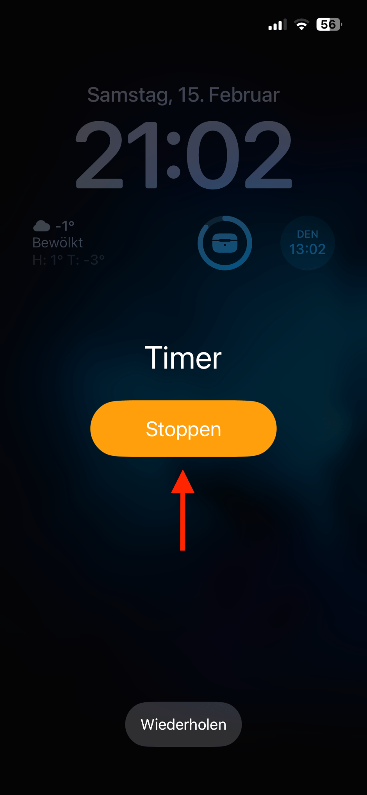
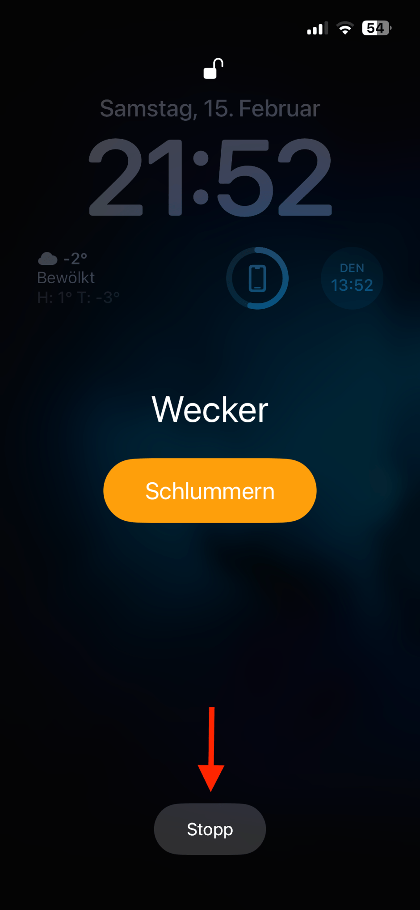

I am generally a huge fan of Apple’s interfaces. Sometimes they are oversimplified in a way that can be frustrating, but as a rule, their great interface design makes their software pleasant to use in a way other companies or entities can’t hold a candle to.

That said, not everything they do is great and some things can be downright frustrating. One of them is the different placements of the “Stop” button on the homescreen for the built-in timer and alarm functions. When they go off and your iPhone is locked, a fullscreen message will be shown that gives you the option to stop them. The designs are identical except for the fact that the “Stop” button is in opposite positions. That leads to me frequently either repeating the timer or sleeping the alarm rather than turning it off. Those are the other functions offered by the other buttons.

You can see what I mean here:

<figure><figcaption>iPhone Timer Stop Button</figcaption></figure>

<figure><figcaption>iPhone Alarm Stop Button</figcaption></figure>

It’s a small thing, but is still a glaring oversight in an otherwise very consistent UI. Of course, this is complaining at a very high level as an Apple user. If this was a Microsoft or open source project, you would just be happy that the screens look somewhat similar and work properly.

*Do you have any pet peeves in any of the interface designs you use on a regular basis? If so, what are they?*