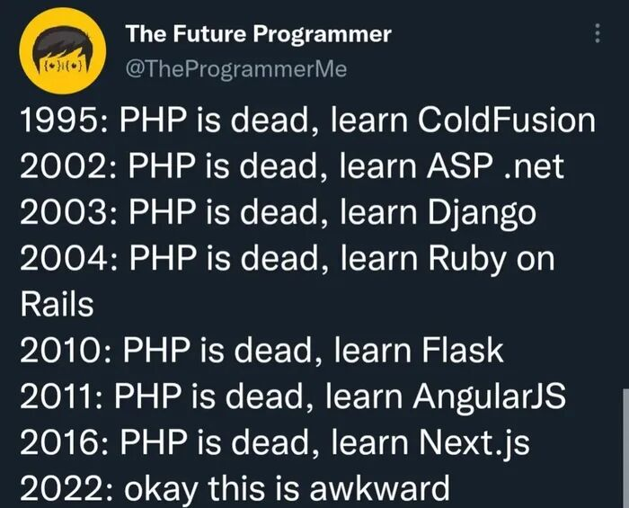

<figure></figure>

Is it really though?

There really isn’t a whole lot to say about this topic other than that PHP is still the stalwart of the internet. New languages come and go, get popular and fade, but PHP still remains dominant.

I used to use PHP for all of my personal projects, but have since moved on to TypeScript/Node.js for most the most part. That is primarily due to being able to share code between frontend frameworks such as React and the backend which makes maintainability and development much easier for a single developer.

I do, however, still maintain several WordPress websites that each have their own custom themes and/or plugins which I’ve programmed in PHP and it really isn’t all that bad.

As terrible as a lot of people find PHP, a language with that sort of staying power and robustness can’t be as bad as some people make it out to be. That might be a controversial statement for a lot of developers, but I would argue it wouldn’t be so widespread otherwise.

Anyway, enough of my ramblings. This post really had no point other than to share the graphic.