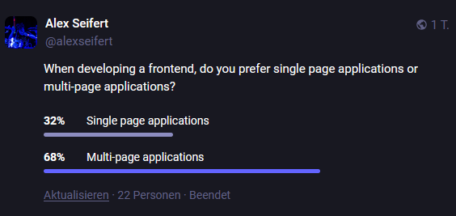

It’s no secret that web development has changed rapidly over the years. There was a time not all too long ago where, for example, JavaScript was not the only scripting language available (anyone remember VBScript?) and CSS was still new. Of course, at the time, single page applications (SPAs) wouldn’t have been possible so all websites were multi-page applications (MPAs).

That has obviously changed. Web developers have more options than ever for the type of website they want to build. SPAs were originally created for web applications that were usually hidden behind a login, but with frameworks like [Next.js](https://nextjs.org/) or [Nuxt.js](https://nuxt.com/), they have become mainstream.

As such, I was interested in seeing whether developers prefer the experience of working on an SPA or MPA. I posted [a poll on Mastodon](https://mastodon.social/@alexseifert/113214180223589194) asking this question and this is the result:

<figure><figcaption>Results of a poll about developing single page vs multi-page applications</figcaption></figure>

We obviously have to take into consideration the fact that only 22 people responded and that the crowd on Mastodon isn’t exactly mainstream. Nonetheless, I posted [another poll](https://mastodon.social/@alexseifert/113220774575462952) asking what they prefer to use as a user rather than a developer:

<figure><figcaption>Results of a poll about using single page vs multi-page applications</figcaption></figure>

Interestingly enough, there was a much better turnout for the second poll. I also received a few comments where people simply said they don’t care as long as the content is good and the website works well.

Either way, SPAs lost significantly in both cases. It seems that not everyone is happy with the trend of SPAs replacing MPAs. As for my part, I also tend to prefer MPAs. There was a time when I preferred both developing and using SPAs, but I’ve found them very difficult to do correctly and the amount of JavaScript required tends to make them slower in many cases (I’m looking at you Jira!).

I also don’t particularly like how rapidly the SPA frameworks tend to change and the resulting amount of refactoring required to support each new release. Angular is the most stable in that regard in my experience.

While the polls on Mastodon are already closed, it would still interest me what you think about the topic. Let me know in the comments!

-   Link to the first poll: [https://mastodon.social/@alexseifert/113214180223589194](https://mastodon.social/@alexseifert/113214180223589194)
-   Link to the second poll: [https://mastodon.social/@alexseifert/113220774575462952](https://mastodon.social/@alexseifert/113220774575462952)