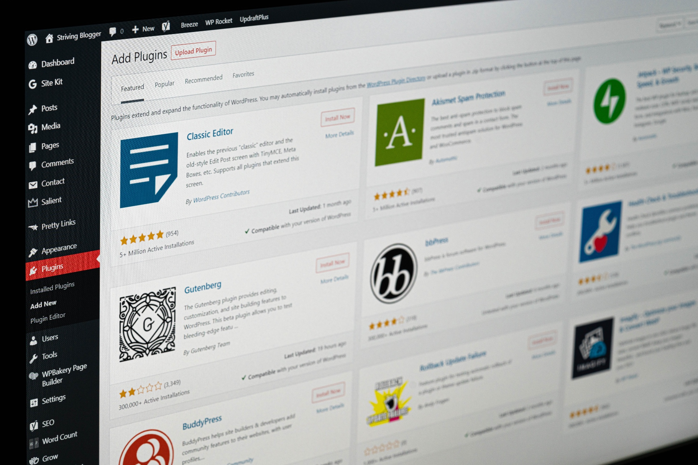

<figure></figure>

One of WordPress’s greatest strengths is its positively *huge* plugin ecosystem. There are plugins for just about everything you can think of out there. At the same time, however, it is also its Achilles’ heel.

Anyone can write a plugin and publish it on the official WordPress repository for anyone else to install. On the one hand, that’s a wonderful thing. It brings an enormous amount of freedom to the platform, but on the other hand, it also has the potential for serious security risks to your WordPress installation.

In fact, we frequently see that in the tech news. Headlines about security vulnerabilities found in plugins are not a rare sight in the tech news. It doesn’t matter whether the programmer was acting maliciously or not, many are simply not secure. The WordPress plugin ecosystem is rife with security holes.

As such, I have always been very cautious about installing plugins in my WordPress installations. My first rule is that I only install plugins from trusted sources and with a lot of installs. Anything from Automattic (the company behind WordPress), for example, is generally a safe bet.

Not only will going with a trusted source with a lot of installs make the likelihood higher that the quality of the code is higher, the plugins are also more likely to receive updates if there is a security vulnerability found. Others may never see another update even if there is a severe security hole. It is entirely up to the developer.

Other than that, I regularly go through the few plugins I do have and see if I can’t somehow get rid of another one of them. Newer versions of the WordPress Core will sometimes bring features that you previously had to rely on plugins for. Other times, you just stop using whatever functionality they offered, so you can uninstall them.

As a programmer, I also don’t install plugins that perform a simple task. Instead, I just add the functionality to my theme or I program a plugin myself so that I know I can trust it. I know exactly what it does. While I run the risk of unwittingly introducing a security hole myself, it at least won’t be so widespread that bad actors are likely to take the time to actively exploit it.

Plugins will also potentially slow down your website by loading unnecessary JavaScript files, fonts, images, CSS files, or other resources. They may be needed for the plugin to work, but if you either don’t need the functionality anymore or only need a fraction of what it loads, it may not be worth the performance trade-off.

In any case, plugins can be a wonderful way of expanding the functionality of your WordPress website, especially if you aren’t a programmer, but they also have a negative side to them. In my opinion, you can absolutely enjoy the massive plugin ecosystem, but they are to be enjoyed with caution.