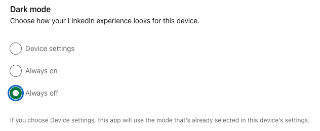

<figure><figcaption>LinkedIn’s dark mode settings default to “Always off”</figcaption></figure>

There is a current trend I don’t understand in web design: websites that offer dark mode but bury it somewhere in their settings. As a web developer, I know it’s more work to offer, maintain and test both light and dark modes which, of course, translates to costs for companies operating websites with both modes. So why bury it?

As a user who has set my device to use dark mode, I have clearly stated my preference for it and since you already offer an automatic switch based on device settings, why not make this the default? Otherwise, it’s an absolutely horrendous user experience. I, as the user, may not even be aware that there is a dark mode option and even if I am, I have to navigate the menu system to go change it when I’ve already clearly told you through my device settings that I prefer dark mode.

Of course, not all websites are like that. This blog, for example, automatically switches based on the device settings which is really quite simple to implement.

So please respect my preference for dark mode. I have already told you I want to use it!