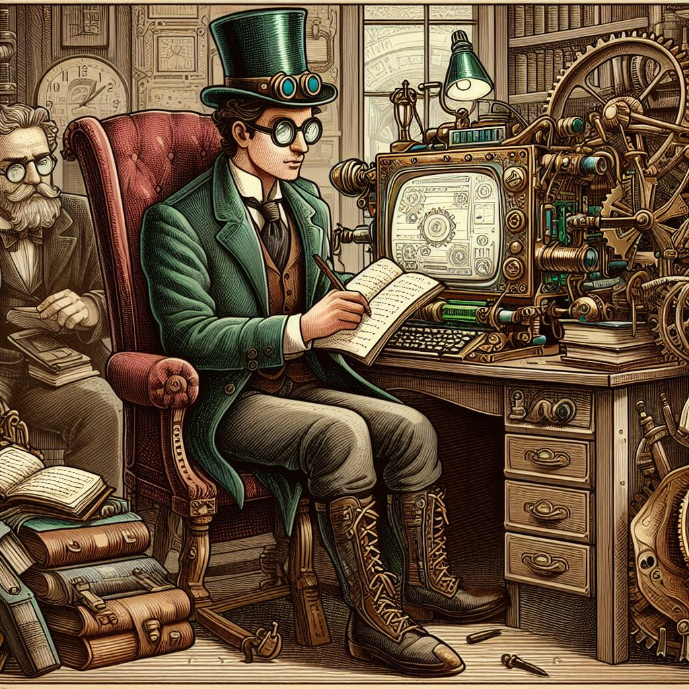

<figure><figcaption>AI-generated man sitting in front of a steampunk computer</figcaption></figure>

Inspired by [this blog post](https://davidwalsh.name/im-so-old-1), I decided it would be fun to write my own list of technologies and experiences that show my age. Most people wouldn’t consider mid-30s to be that old and it really isn’t, but from a technological standpoint, it might as well be millennia.

So, let’s dive into it. These are the things I remember using and experiencing for the first time that are now obsolete or have changed considerably since I first encountered them:

-   Three-button mice without a wheel
-   Single-button mice on Macs (without multi-touch)
-   20″ CRT monitors that seemed giant and would briefly dim the lights when you turned them on
-   Crunchy hard drive noises
-   The sound of a modem connecting
-   Desktop computers that didn’t have enough power to play an MP3
-   Upgrading to Windows 95
-   Ghosting on passive matrix laptop screens (both color and black and white)
-   Subversion was the latest and greatest code versioning system
-   JavaScript had a competitor from Microsoft that only ran in Internet Explorer: VBScript
-   JavaScript was sparsely used on websites
-   JavaScript was only used in the frontend
-   PHP’s first release
-   ASP before .NET was appended to it
-   Rounded corners on websites were achieved with images… most of which weren’t even transparent
-   ColdFusion
-   Macromedia Flash
-   Guestbooks on websites
-   Hit counters on websites
-   The Netscape Communicator software suite
-   Brushed metal and pinstripes were modern UI elements for Mac OS X
-   Multiple cores meant multiple processors
-   Separate math coprocessors
-   Schools requiring kids to bring floppy disks to store their work from the computer lab
-   America Online (“You’ve got mail!”)
-   Firebug was a revolution in web development
-   Creating websites with Microsoft Frontpage
-   AltaVista
-   When I got an invitation to join Gmail for the closed beta period in 2004
-   Microsoft Encarta
-   Web directories
-   Blogrolls
-   The fact that the [Microsoft IntelliMouse Explorer](https://www.neowin.net/news/a-quick-look-back-at-the-reveal-of-the-microsoft-intellimouse-explorer-25-years-ago-today/) had a laser instead of a track ball was an amazing feat of technology
-   *…and many more*

The more I wrote, the more I remembered which is how that list got so long. I could have easily kept going, but decided that the list was long enough, so I stopped there.

It’s been a fun trip down memory lane and there are certainly things I miss about technology from the past, but mostly I prefer technology from the present.

*What technologies do you remember using for the first time or that have died off since? Let me know in the comments!*