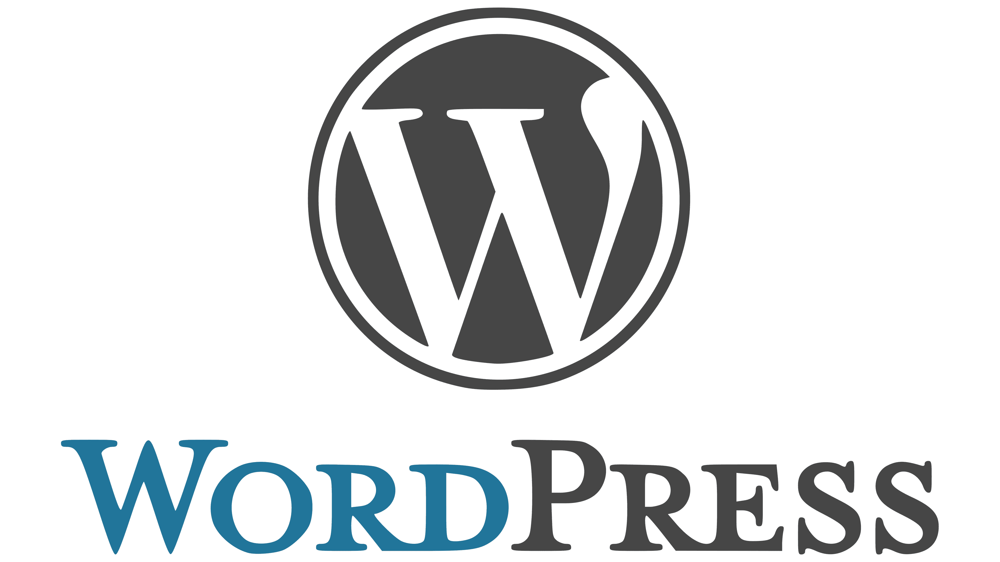

<figure></figure>

I have been using WordPress to run many of my websites since 2007 when I first started this blog. Back then, it was a lean piece of blogging software that was easy to use and contained all the features a person running a blog would need.

However, since then, it has exploded in popularity to power an enormous amount of the internet, and as its popularity has grown, so has its feature bloat. While it still works well for basic blogs, the sheer amount of CMS-like features that come with it nowadays are entirely useless to me.

The new [block themes](https://wordpress.org/documentation/article/block-themes/), for example, do absolutely nothing for me. As a developer, I create my own custom themes and if I need a specific layout for a page, I will program it myself. Block editing may be great for non-developers but is nothing but bloat for me.

Alternatives
------------

Of course, feature bloat doesn’t happen overnight. This has been a long time coming and therefore I have been looking at alternatives for quite a while. [Ghost](https://ghost.org/) would be my first choice as it solely focuses on content creation which is all I need. I can create my own themes much like with old-world WordPress and be done with it without much bloat.

I haven’t made the leap to Ghost yet though because, as a developer, I am constantly thinking about how I could just make my own blogging software. I don’t need an entire CMS and can simply redeploy the website every time I create a new post.

I have made attempts on and off over the years as can be seen by searching for “blog” in my [GitHub account](https://github.com/eiskalteschatten?tab=repositories&q=blog&type=&language=&sort=). Nothing has ever borne fruit, however, because I get distracted or have a new idea for it or I just give up because I want to focus more on content with the little free time I have. The list of reasons why I never get finished is as large as WordPress itself has become.

This endless quest to replace WordPress has been going on for at least eight years and will probably continue until I finally do replace it one day. The question is really just: When is that going to be?