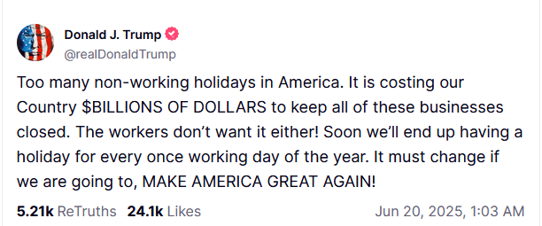

Yesterday, Trump wrote a post on his social media platform that could only come from someone who is used to being in upper management:

<figure></figure>

I’ve scratched my head at Trump’s antics so much in the past half year that I’m beginning to have a bald spot.