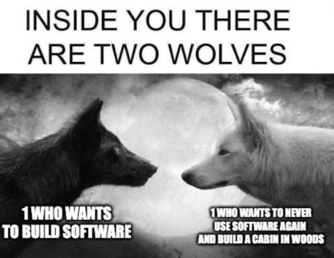

<figure></figure>

I don’t often post memes or other images I find on the internet because I prefer original content. However, sometimes I stumble upon one that really just hits the nail on the head and this is one of them.

I love computers and programming, but I somehow hate them at the same time. Sometimes I really do wish I could retreat to a cabin in the woods and never have to use any computer or derivative (i.e. smartphone, table, etc) ever again.

For me, that’s usually a sign that I’m tired, burnt out, and ready for a break. At that point, it’s time to take a vacation and leave most of my technology at home. Afterward, I come back feeling refreshed and ready to dive into programming once again.