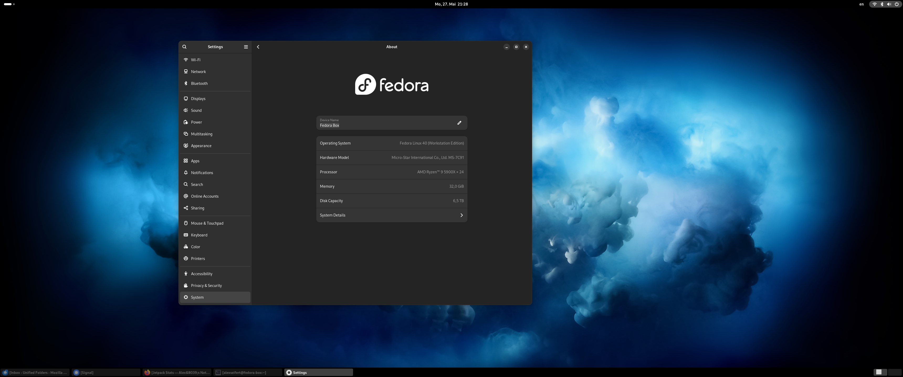

<figure><figcaption>Fedora 40</figcaption></figure>

A couple of years ago, I bought my first desktop PC since about 2002. I had pretty much exclusively used a Mac since I bought my first iBook in 2001 and I was curious to see how the PC world had developed in the intervening years. I also wanted to play *Red Dead Redemption II* and *Cyberpunk* among other games, so I made the leap and bought a desktop PC.

The first one was a cheap, refurbished Dell to test the waters. It ran Windows 10 and I was impressed with how far Windows had come since Windows XP was new. It still couldn’t hold a candle to macOS in terms of how polished it and stable it is, but it had definitely made some major improvements.

So I decided to go all in and build my own PC. I’m not a huge gamer, so the hardware didn’t have to be the latest and greatest, but I also wanted something much better than average. So I ended up with this:

-   AMD Ryzen 9 5900X 12-Core Processor running at 3.70 GHz
-   MSI MAG B550 Tomahawk motherboard
-   Nvidia GeForce GTX 1660 Super graphics card
-   32 GB of RAM
-   2 TB M.2 SSD as my main drive
-   4 TB HDD for extra storage because I could
-   Be Quiet! case
-   Windows 11 Pro

It’s a system that is much faster than I need for most things and has way more storage than I know what to do with (I’ve used about 200 GB of the 4 TB drive and about 850 GB of the 2 TB drive), but I figured it was a good configuration for the middle ground between “this PC is going to blow my socks off” and “I also still have a family to feed”.

Linux
-----

Since part of my buying a PC was to experiment, I decided to take it a step further and install Linux on it. The first thing I did was install an extra 500 GB SSD I had lying around to use as the installation drive for Linux because I was feeling lazy and didn’t feel like partitioning one of the drives I had already installed in the computer.

Once that was installed, I decided to install Fedora on it. Why did I choose Fedora of all distros? Because its main color is blue and that is my favorite color. I’ve read a ton about different Linux distros over the years and since that seemed about as good of a reason as any for choosing a distro, I went with it. Well, that and I wanted a stock GNOME experience.

Fedora installed without a hitch and everything worked out of the box. I didn’t have to install any additional drivers at all. Even my wireless card and Nvidia graphics card worked. So, I set about getting my development environment set up so I could feel much more justified in having the neckbeard I had started growing.

I got everything set up just the way I wanted it, got Thunderbird going for email, got everything synchronized and it all worked beautifully. I even did a little bit of customizing GNOME, although that was pretty much limited to changing settings in the GUI because I was content with stock GNOME for the most part as it was.

I ran Fedora as my primary OS on my PC for several weeks to give it a real try. I’ve always dabbled with Linux here and there in virtual machines and have used it to power my personal servers as well as used it at work on many different occasions. I wasn’t a complete stranger to Linux, but had also never used it as my daily driver workstation OS.

The experience was really pleasant except for a few irritations that eventually got me back to using Windows.

Going Back to Windows
---------------------

The first time I booted back into Windows felt a little bit like coming back home after a long trip away. Things are familiar and yet you see them in a new light. I’m still not a huge Windows fan and still primarily use my Mac for most tasks, particularly for development of any sort, but it was nice to be back in Windows.

The reasons I switched back won’t be reasons for everyone, but they were enough for me. First of all, I couldn’t play any of the games I had originally built the PC for in the first place. Since I use Steam for my games anyway, I tried Valve’s Proton technology, and while I was able to get the games installed, I could never get them to actually run. The screen would just turn black and stay black. I probably could have sat down and figured the problem out, but frankly, I would rather spend what little free time I have playing the games.

Secondly, updates for programs like Thunderbird were always way behind the rest of the world. I know it seems silly to some people, but I *really* like to use the latest versions of applications and unless I was willing to manually download the latest version every time there was a release, I would have to wait for weeks for an update to show up in the package manager.

Thirdly, as a long-time Mac and iPhone user, I am deeply embedded in the Apple ecosystem. I use iCloud to synchronize just about everything: iCloud Drive for my files, iCloud Photos for my photos, etc. There just isn’t a good way to synchronize those things with a Linux system. Windows at least has an official iCloud app, even if it is shoddy compared to the software Apple devices ship with (surprise, surprise…).

Fourthly, I [make music](https://www.alexseifert.com/hobbies/music/). There are plenty of OSS DAWs out there for Linux and I’m sure they’re very good, but I am not used to them and I don’t have a lot of time to spend learning new software. I would rather spend it actually making music than fiddling around with unfamiliar software. I’ve used [Propellerhead Reason](https://www.reasonstudios.com/) for over 20 years and it is only available for Windows and macOS. If I ever suddenly get a vast amount of free time, I might try making music on Linux, but I just don’t have the time at the moment.

And lastly, games. Oh, wait, did I mention games already? Yeah, I was REALLY tired of having to boot into an entirely different OS every time I just wanted to play a game.

Conclusion
----------

I still have the 500 GB SSD with Fedora installed in my computer and I could boot into it at any time, but I haven’t in months. It was a fun experiment and I really did enjoy it, but I just don’t have the time to learn new, complex software or figure out why my games aren’t working. I would rather spend my precious little free time making music or playing my games.

If I were just developing on my PC, then I might be able to live with the other issues such as late program updates, but I do so much more on it that requires commercial software just not available on Linux. For now, I think I’ll stick with macOS for development and Windows for gaming. Linux will always be my OS of choice for servers, though, because that’s where neither macOS nor Windows can even come close to competing.