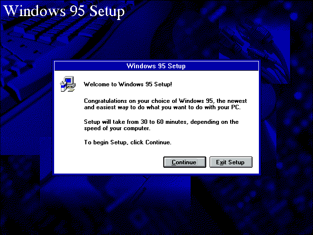

<figure><figcaption>Windows 95 Setup in Windows 3.1 Mode</figcaption></figure>

Have you ever wondered why the Windows 95 setup seems to consist of three different types of UI? It starts with a typical text-based, MS-DOS UI, then moves onto an interface with buttons and other elements resembling those found in Windows 3.1. Then, in the final stage, you see elements that look like they belong to Windows 95.

As it turns out, that is due to the fact that setup actually runs on three different operating systems: MS-DOS, Windows 3.1 and Windows 95. This seems somewhat excessive, but Raymond Chen, a developer at Microsoft who has worked on Windows for over 30 years, wrote [an explanation on one of Microsoft’s official blogs about about the reasoning behind it](https://devblogs.microsoft.com/oldnewthing/20241112-00/?p=110507):

> Windows 95 setup could upgrade from three starting points: MS-DOS, Windows 3.1, or Windows 95. (Yes, you could upgrade Windows 95 to Windows 95. You might do this to repair a corrupted system while preserving data.)
> 
> One option is to write three versions of Windows 95 setup: One for setting up from MS-DOS, another for setting up from Windows 3.1, and a third for setting up from Windows 95.
> 
> This was not a pleasant option because you basically did the same work three times, but implemented separately, so you have to do three times the coding.
> 
> A better option is to just write one version of Windows 95 setup and use it for all three starting points. So now you get to choose the platform on which to base your code.
> 
> \[…\]
> 
> In the middle is the happy medium: You can have the MS-DOS setup program install a minimal version of Windows 3.1, just barely enough to support what the 16-bit GUI setup program needs.¹ This tiny version is small enough to be copied and installed off a small number of floppy disks. Once that’s done, boot into the tiny version of Windows 3.1 and run the 16-bit GUI setup program.
> 
> [Raymond Chen](https://devblogs.microsoft.com/oldnewthing/20241112-00/?p=110507)

For anyone interested in retro operating systems or computing history, this is a short but very interesting article about the challenges they faced making Windows 95 installable on as many computers as possible back in the early-to-mid ’90s.

Here is a link to the original article: [https://devblogs.microsoft.com/oldnewthing/20241112-00/?p=110507](https://devblogs.microsoft.com/oldnewthing/20241112-00/?p=110507)