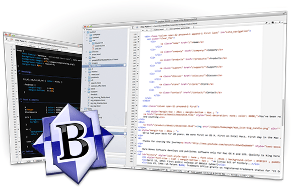
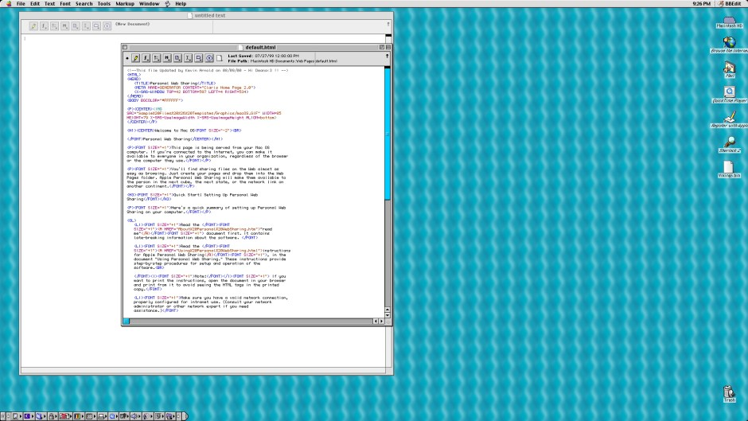
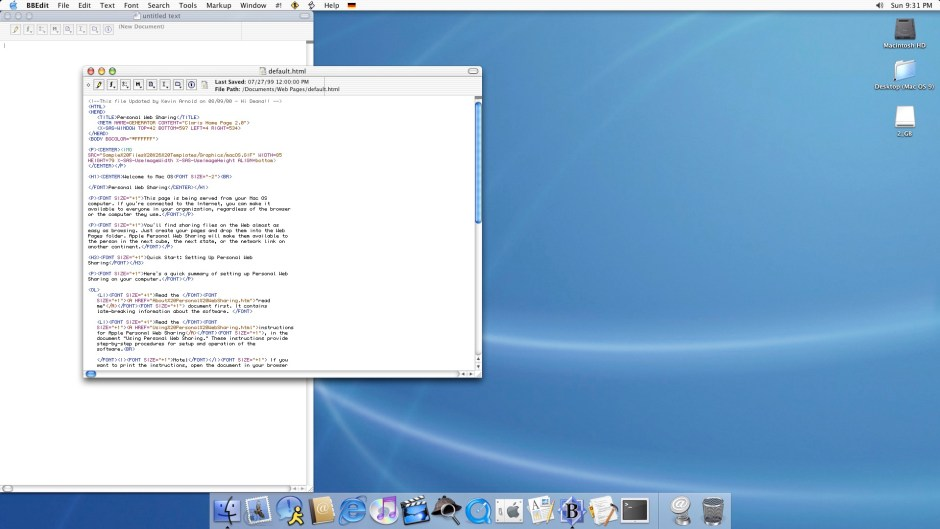
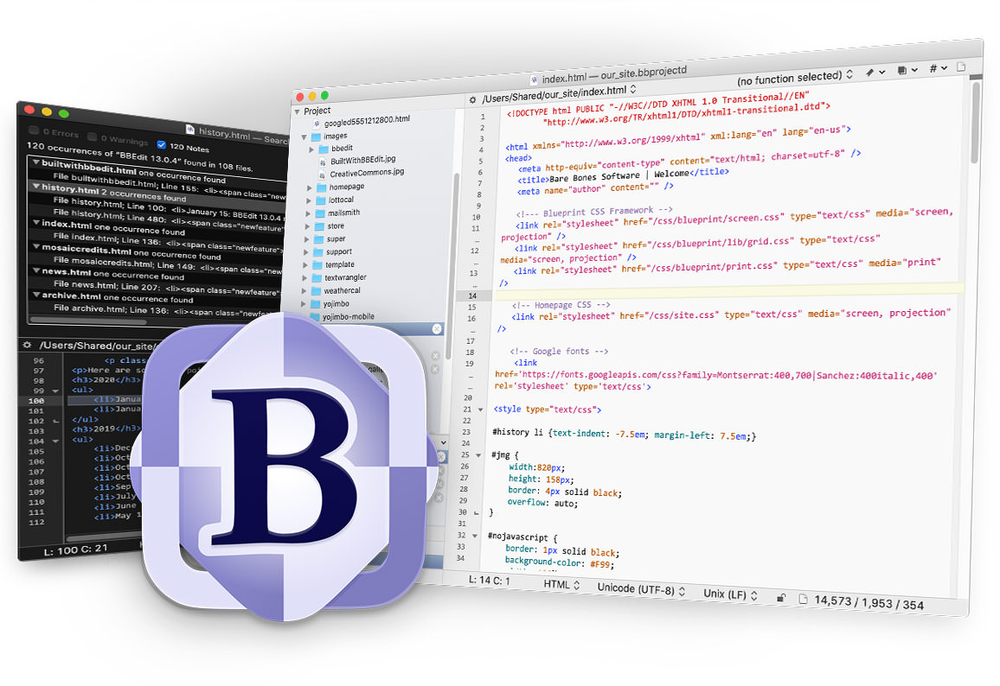

<figure><figcaption>An old version of BBEdit by Bare Bones Software</figcaption></figure>

A couple of weeks ago, I bought a license upgrade for the staple Mac editor [BBEdit](https://www.barebones.com/products/bbedit/index.html). The current version is 15 and I upgraded the license I first bought well over a decade ago but hadn’t upgraded since version 11. I don’t use BBEdit as my primary workhorse while programming, but still felt the need to purchase an upgraded license.

This isn’t anything BBEdit’s maker, Bare Bones Software, has done or the editor pushing me to upgrade (which it doesn’t) but rather because I want to support them. I have used the editor for decades at this point and still use it frequently when my primary editor, Visual Studio Code, just doesn’t cut it. It is particularly good at handling huge text files, for example — something Electron-based VSCode just simply can’t do.

That said, I have used it as my primary editor in the past and even wrote [a short review](https://blog.alexseifert.com/2012/12/06/bbedit-positives-and-negatives/) of the then-new version 10.5 back in 2012 on this blog. In fact, that is where the image at the top of this post comes from.

I started using BBEdit with version 7 on Mac OS 9 back in 2001. Admittedly, I pirated a serial number since I was still a teenager and couldn’t afford to purchase one. I used it as my primary editor until I was forced to use Eclipse by a job I had taken. At the next job, I had to use Windows, so BBEdit was also out of the picture. By the time, I had a Mac again at work, Visual Studio Code was around and I had already gotten used to that and its robust feature set.

But back to old versions of BBEdit. As I have also written about on this blog, I own a couple of old Macs and, of course, I had to install BBEdit 7.1 on them. Since I didn’t have the pirated serial number anymore, I thought I would contact Bare Bones Software and see if I could still buy one. They didn’t accept my money, but instead just sent me a serial number for free. The support was really awesome and they sounded genuinely excited that someone was interested enough in such an old version to be willing to buy a license. That wonderful experience was another reason I felt the desire to upgrade my actual license to version 15.

Since we’re on a retro road trip, here are some screenshots of BBEdit 7.1 from [my blue and white PowerMac G3](https://blog.alexseifert.com/2024/04/17/my-new-powermac-g3-blue-and-white-part-1/):

<figure><figcaption>BBEdit 7.1 on Mac OS 9</figcaption></figure>

And now the exact same file with the exact same version of BBEdit on the same exact computer but on Mac OS X 10.2:

<figure><figcaption>BBEdit 7.1 on Mac OS X 10.2</figcaption></figure>

BBEdit 7.1 was a Carbon application which allowed it to run on both Mac OS 9 and early versions of Mac OS X. The screenshots above are from the exact same binary located in the exact same location on the hard drive. There isn’t a copy for Mac OS 9 and another for Mac OS X. It is literally the same one.

But I digress. Essentially, my choice to buy an upgraded license comes down to this: I appreciate the editor for its robustness, longevity, stability, and the fact that it’s a native Mac application unlike most other editors available on the market today.

So why don’t I use it as my daily workhorse anymore? Unfortunately, it lacks a few key features I have gotten used to over the years that speed up my development. Basic features such as command-clicking on variables, imports, and objects to jump to their definitions or certain keyboard shortcuts that I rely on but just simply don’t exist in BBEdit.

Despite those shortcomings, I still love the editor and its history. In the end, that is why I decided to fork out the money and upgrade my license.

And by the way, BBEdit’s marketing images are as stable as the editor itself. They have hardly changed over the years. The one at the top of the article is twelve years old and the one below is one I just copied from their website advertising BBEdit 15:

<figure><figcaption>BBEdit 15</figcaption></figure>