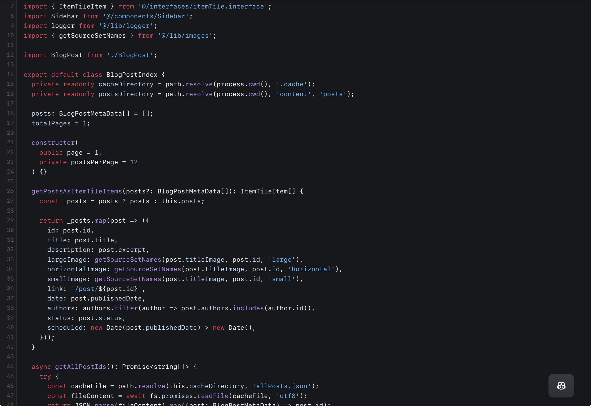

<figure></figure>

When I write code, I tend to use long, descriptive variable names with few abbreviations. Some of my past colleagues have asked me why I bother to type out a long variable name when a shorter or abbreviated one would work just as well. Well, this is why.

But before I get into the why, let’s clarify something right away. Believe it or not, it’s not because I used to program with Java; I was already in the habit before I ever wrote my first line of Java code. Now that we’ve got that out of the way, let’s move on.

There is exactly one reason for my use of longer variable names: clarity. I want to be able to know what the purpose of the variables is at a glance without always having to look at their use in the code. When you write the code, you know what the variable does, but it saves time later on when you come back to the code. It also saves your fellow developers time when they have to engage with your code.

Of course, that isn’t always possible with variables, but it is my general philosophy when defining a variable’s name. It’s also why I tend to work with more immutable variables rather than reusing fewer mutable variables. Since I primarily work with garbage-collected languages, I’d rather have more variables that each have a distinct, clear purpose. I just recently learned about the JavaScript function `[WeakRef](https://developer.mozilla.org/en-US/docs/Web/JavaScript/Reference/Global_Objects/WeakRef)` which I fully intend to make use of for my variables.

You might argue that more variables with longer names make the code more bloated. It certainly does make the code longer and more verbose, but I think it also makes it clearer and more legible. There might be more to read, but if done properly, you will have to read less of it to get the same understanding of its purpose.

In 2024, we as developers no longer have to work under the same hardware limitations we did 30 years ago that contributed to the rise of, for example, single-letter variables. That said, there is still one area where the size of a file matters: frontend JavaScript files. I say “frontend” here because I solely mean the type downloaded and consumed by a user’s browser. The smaller the size, the faster the file loads which can make a noticeable difference in the user experience.

In this case, I still use long variable names as most of the time, the JavaScript files I write are minimized anyway. As part of the minification process, variables are replaced with single, double or triple-letter variables depending on context and the variables in the same scope. That means they are reduced to the absolute minimum in size anyway before the user’s browser downloads the JavaScript file.

In the end, it just comes down to my preference for being able to understand old code more quickly. I think the tradeoff of having more verbose code is worth the time it saves to be able to understand what a variable’s purpose is at a glance.