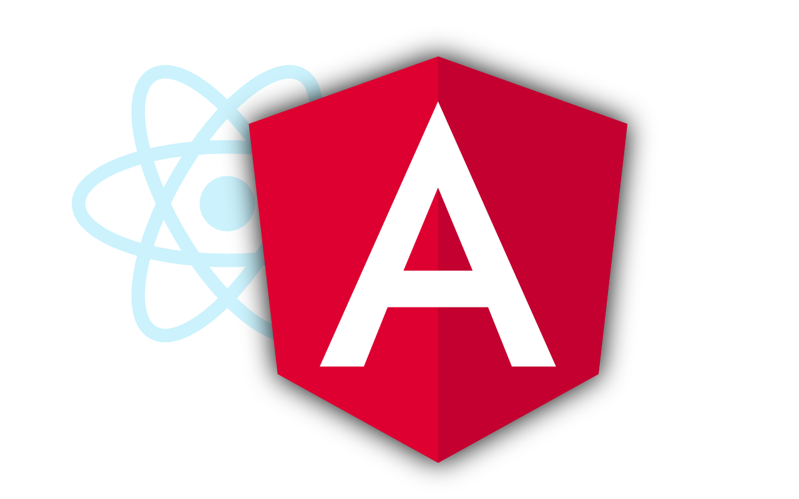

<figure></figure>

For years, my go-to frontend framework was React. I started using it professionally around 2015 and so it was a natural choice to use for my personal projects as well since I was already in the mindset.

Of course, I have also dabbled around with others since then, particularly with Vue, but they never really stuck. I always just ended up using React in the end for whatever project I wanted to pursue.

So why would I suddenly want to start using Angular when nothing else stuck?

*Note: I know that some developers call React a* library *rather than a* framework*. That is probably more accurate, but I’m going to continue calling it a framework in this article because when I say “React”, I’m referring to the entire ecosystem rather than just React itself.*

A New Job
---------

Earlier this year, I started a new job. I was hired as a frontend developer, but the project called for using Angular rather than React. When I applied for the job, I figured it would give me a good opportunity to truly try out another framework and see how it works, looks and feels for me. What I discovered blew me away.

Now, I know Angular isn’t the most popular framework amongst developers and particularly not amongst frontend developers. I’m pretty sure that is because it forces you to think much more like a backend developer than frameworks like React or Vue.

It is a strongly opinionated, object-oriented framework and you have to think in terms of classes (not the CSS variety!), services, components and modules. React and Vue are much more flexible in terms of how you can compose your components and structure your code. Both have their pros and cons, but as a full-stack developer, I’ve found I rather like having to write object-oriented code.

Why Angular?
------------

After having used Angular professionally for several months now, I have decided that React just can’t compare to Angular in a number of different ways. I’ll sum them up here in no particular order.

### Services

I love services in Angular. They are the primary way data is handled and are simple, intuitive, easy to unit test and ideal for handling large amounts of data.

So how do they work in Angular? I won’t go into a huge amount of detail because that is beyond the scope of this article, but I will give a very quick overview. Essentially, they are injectable classes that are used to fetch and store data in the application.

Angular treats each one of them as a singleton and therefore the data stored in the class is persisted during entirety of the user’s session. To use them, you just inject them into your component classes by importing it as a variable in the constructor and then you have access to all public functions and variables, including the data they hold.

When comparing Angular services to the closest thing in the React world, you get a combination of the native Context API and a third-party global store such as Redux. The Context API allows you to avoid prop drilling, but has to be used with caution because every time a change happens, React re-renders all of the rendered components that use it. Data is only persisted as long as the component containing the provider is still mounted.

Redux and other stores are globally available throughout the application and data is persisted throughout the entire user session. Re-rendering isn’t as much of an issue here, but all of that comes at a cost: massive amounts of boilerplate code. Writing reducers and thunk actions in Redux is powerful, but tedious and painful, especially if you use TypeScript. Getting the types right can have you pulling your hair out in frustration.

Angular services solve all of those problems and are as easy to use as writing any other class in TypeScript. That’s it. That’s literally it. No boilerplating, no re-rendering problems. It just works.

### Everything Is Included

Unlike React which requires you to find and use extra dependencies such axios for requests, Redux Router for routes or Redux for a store, Angular comes with practically everything you need for most applications right out of the box. This is hugely beneficial.

First off, you have the assurance that, since they are released in tandem, they will continue to play nicely with each other even after updating. This doesn’t always happen in the React world since each dependency is, well, independent and therefore is not always tested with each other. I don’t know how many times I’ve had even minor updates break compatibility. It’s frustrating and costs a lot of time to fix.

Since everything is designed for Angular, you also don’t need “crutch” packages in order to use them within the Angular paradigm. With React, you often have to install a dependency, then see if there is a “react-{library-name}” package that will adapt it to work with React hooks or higher order components (HOCs). This makes updates to packages even trickier because a lot of these “crutch” packages are updated irregularly and will break if you update the main package by itself.

The final reason I’m going to mention here is documentation. Since most developers in the Angular world use the included packages, it is extremely likely that if you have a question, someone has already answered it online. By using the same setup, it means the answers are much more likely to apply to your setup than if you have a random set of packages thrown together. This also makes development much faster when you run into issues you need help with.

### Project Organization

Project organization has always been a real pain point for me when it comes to using React for large projects with multiple developers. Since it is an unopinionated framework, you can set up your project and organize your code however you want. There is very little structure provided which means if you want consistency within a large project, you have to be very strict with pull requests and use other tooling such as linting to enforce certain styles.

React’s approach provides maximum flexibility and that can be a great thing for smaller projects, but the reality, in my experience, is that it leads to chaotic organization in larger projects

Angular’s approach to this is better. It is object-oriented which means you have the structure that classes naturally provide for code. Angular’s CLI tools automatically create everything you need for a component: the component class, the HTML file, a file for unit tests and a SCSS file. The same goes with services, directives, modules, routers, etc.

Since the built-in tooling automatically sets up what you need to create these items, it will always be consistent.

Of course you still need linting, but you only have to rely on it to make sure the code is clean rather than organized. Angular still lets you set up the directory tree any way you like, but it has required structures, such as modules, that ensure that the code is still consistent and organized.

There are numerous advantages to clean, organized code and one of them is the ability to switch between projects. When you move to a new React project, you often have to spend a lot of time figuring out how the project is set up, whether they are using class-based or functional components (or a wild mix), etc. With Angular, you have certain structures you can always rely on which makes it much easier to understand a new project.

### Two-Way Binding

Two-way binding is a concept I didn’t realize I intuitively understood until I looked it up and it is incredibly powerful. Coming from the React world, I was used to using hooks such as useEffect in order to be able to react to changes in variables. That is, after all, a core component of React.

Angular solves this differently. Component variables (the equivalent of state variables in React) are public class variables that don’t need to be watched in order to react to a change in value. Since the data flows in both directions (two-way binding), the class variable is automatically updated.

So how do you react to a change in value then? Simple: you just use the standard “get” and “set” properties for class variables. For example:

```typescript
private user: User;

get firstName(): string {
  return user.firstName;
}

set firstName(name: string) {
  user.firstName = name;
  // Do something here when the first name is updated
}
```

That means you are using entirely native TypeScript code. It is consistent, easy to read, easy to understand and you don’t have to deal with the weird side effects that hooks like useEffect often have in a React application.

### Server-Side Rendering

Yes, I know React supports server-side rendering and I know that there are frameworks such as [Next.js](https://nextjs.org/) that make it a piece of cake to build a server-side rendered single page application using React, but you know what? Angular does it out of the box. And it just works.

You don’t need another framework, you don’t need to worry about routing, you don’t need to worry about much of anything. You run a single command using the Angular CLI and it automatically sets up an Express server with the right configuration. It just works, right out of the box.

Of course, you can use an existing server or a different server framework, such as Fastify or Koa, if you prefer. Since there is very little you have to configure, it is incredibly easy to set up and get running manually as well.

Angular even has the ability to pre-render content if you want an entirely static website. The only detriment here is that, unlike Next.js which has the same capability, there is no way of updating the pre-rendered content once it has been created unless you re-build the entire application. That, for me, is the only major downside to it.

Reasons for Continuing to Use React
-----------------------------------

So now that I’ve written about the reasons why I’ve started using Angular rather than React, I think it’s time to show React a little love as well. After all, it’s still a great framework that has its positive aspects as well.

I won’t go into too much detail about that here though because that isn’t really the purpose of this article. It probably deserves its own post.

The first thing that would keep me using React is my experience level with it. Since I have been using it for years, I’ve gained quite a bit of knowledge about its quirks and generally how the framework works.

Since my experience with Angular is much more limited, I still have to read quite a bit of documentation in order to figure things out that I would just know with React. An example of that is when exactly component re-rendering occurs. With time, I will get to that level with Angular too, but it will take a while. In the meantime, I’m just going to have to settle with being a little bit slower.

The second reason is that, through all of my personal projects, I have built up quite an extensive catalog of generic React components I can reuse in different projects. These include buttons, input fields, toasts, dialogs, popup menus, spinners and so many more.

They are styled the way I like them and they usually have additional functionality. My button component, for example, has a built-in spinner so that when you submit a form, it can disable the button and show a spinner within the boundaries of the button.

Being able to copy these components from project to project means I save a lot of time. Starting over with Angular means I don’t have any of those components and will have to rebuild them from scratch. While that isn’t terrible, it will cost a lot of time and is certainly a reason for me to keep using React for my personal projects.

Conclusion
----------

I think that about does it for why I’ve switched from React to Angular for my projects. There are a lot of aspects I really love about Angular that make it, in my opinion, a far superior framework to React, but that also doesn’t mean that everything about React is terrible.

According to surveys, Angular is one of the least-liked frontend frameworks and I can only assume that has something to do with its complexity and its object-oriented, “backend” mindset.

Frontend developers tend to be more creative types and generally seem to dislike being forced to use certain conventions to get their work done. Angular forces you to use classes, structure your code in modules and to do all of that in TypeScript — which comes with a learning curve of its own.

Those are aspects I really enjoy about it, but that might be because I’m a full-stack developer who does both frontend and backend. In any case though, I’ve been enjoying learning Angular and will continue to post about it in the future.

*What is your favorite frontend framework and why? If you are one of the developers that doesn’t like Angular, why is that? Let us know in the comments below!*