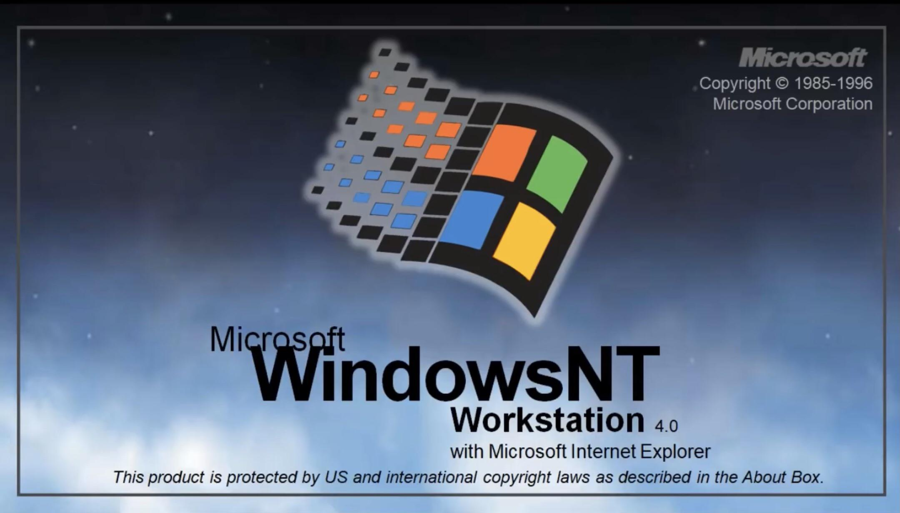

<figure><figcaption>Windows NT Workstation 4.0</figcaption></figure>

This is an excellent read for any of you operating system nerds out there. The author compares the architectures of both Windows NT and Unix and goes into a decent amount of detail about both.

What particularly interested me was how purposefully Windows NT was designed versus how haphazardly Unix has come together over the decades. Of course, Unix is much older than Windows NT and Microsoft had the benefit of learning from some of Unix’s mistakes.

In any case, I recommend you give it a thorough reading if you’re interested in that sort of thing:

[https://blogsystem5.substack.com/p/windows-nt-vs-unix-design](https://blogsystem5.substack.com/p/windows-nt-vs-unix-design)